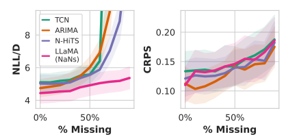
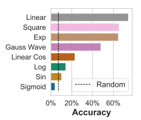

## 本周工作进展
1.改开题报告（加入构建CoT数据集进行大模型微调）
2.运行xlstm-Mixer代码
3.读论文

### 1.代码
不使用Docker：

报错：
  

使用Docker：

  
 
  
### 2.（2023 NIPS）Large Language Models Are Zero-Shot Time Series Forecasters
https://arxiv.org/pdf/2310.07820
用LLM来做TSF的思路就是给LLM输入过去序列的数值组成的句子（中间用逗号隔开），希望它预测未来序列的数值组成的句子，如下图所示：

但是关键点在于，如何利用一些技巧，让LLM能够预测准。

**Tokenization**
tokenizer是句子输入到LLM中的预处理步骤（分词和编码），那现有的LLM比如GPT3的tokenizer不能直接用来编码时间序列的句子。比如对数字42235630，tokenizer处理之后为三个token：[422，35，630]，如果数字中某一位改变了，那tokenizer后的token可能完全不一样。作者提出了一种特定的tokenization方式，将时间序列数据编码为数值字符串。具体来说，他们将每个数值用逗号分隔，并在数字之间添加空格以确保每个数字被正确标记化。如下图所示（图中每个颜色框代表一个token）：

对于GPT3来说，给数的每位之间加上空格（这样会把每位当成一个token），效果要比不加空格要好。

对于LLaMA来说，它本身的tokenizer就已经会把每位数当成一个token，因此无需再加空格，加了反而损害性能。
- 作用：
   1.确保每个数字被正确标记化
   2.提高模型的数值理解能力：通过在数字间加空格，模型可以更清楚地看到每个数字的边界，从而更好地理解数值的结构。这有助于模型在生成预测时更准确地处理数值。
   3.避免数值混淆：如果数字之间没有空格，模型可能会将不同的数值混淆。例如，12 和 21 可能会被错误地解析为相同的标记，导致模型无法区分它们

**Continuous likelihoods**
虽然LLM的概率分布是离散的（token是离散的），但可以将其转换为连续概率密度。如下图所示的例子，假如保留三位小数，则每0.001范围形成一个bin，bin内的所有数值服从均匀分布。如0.537和0.538之间的这个bin内，赋一个均匀分布。这样，LLM的概率分布就成了连续的。

- 优点：
1.捕捉数据的不确定性：时间序列数据通常具有不确定性，未来的值可能在一定范围内波动。通过将时间序列数据转换为连续分布，可以更好地捕捉这种不确定性，为每个可能的未来值分配一个概率，从而提供更全面的预测结果。
2.提高模型的表达能力：连续分布能够更灵活地表示复杂的时间序列模式，通过使用连续分布，模型可以更准确地表示时间序列数据的内在结构。
3.便于模型的训练和优化：在训练模型时，连续分布提供了更平滑的损失函数表面，有助于优化算法的收敛。此外，连续分布允许使用诸如最大似然估计等统计方法，这些方法在处理连续数据时更为自然和有效。
4.与LLMs的生成能力相匹配：大型语言模型（LLMs）本质上是生成模型，能够生成连续的文本序列。通过将时间序列数据转换为连续分布，可以更好地利用LLMs的生成能力，生成更符合实际分布的预测结果。
**Language models as flexible distributions**
对于为什么LLM能做序列预测的原因：因为序列预测本质上就是对未来值的条件分布进行建模，简单的RNN都能拟合复杂的数字数据分布，更何况LLM。作者手动生成了三种不同的分布：指数分布、T分布和均匀分布的组合分布、ARIMA实际预测的残差分布。然后作者采用几种不同的方法来拟合分布，用Wasserstein距离来衡量拟合分布与实际分布的距离，发现十进制自回归语言模型（decimal AR）能达到非常好的拟合效果，如下图所示：

作者在多个基准时间序列数据集上评估了LLMTIME的零样本预测能力，与许多流行的时间序列基线方法进行了比较。实验结果表明：
- LLMTIME在零样本评估中实现了比专用时间序列模型（如ARIMA、TCNs和N-HiTS）更高的似然性和CRPS值。
- 在确定性指标（如MAE）上，LLMs也表现良好，获得了每个基准的最佳或第二佳MAE值。
- LLMTIME在处理缺失数据、容纳文本侧信息以及回答帮助解释预测的问题方面具有自然优势。

**为何能zero-shot预测**
假如有一个人工生成的序列，用不同复杂度的模型来拟合它（比如不同次数的多项式函数），然后外推，希望找到较小复杂度的模型，既能拟合很好，又不会过拟合，如下图中的复杂度13。这叫奥卡姆剃刀原理。可以发现，LLM的NLL最小的时候，正好对应的是这个复杂度13的模型。也就是说，LLM可以找到数据的低复杂性解释，使他们能够zero-shot外推数值序列。

**LLM本身的影响**
LLM越强，预测越好。如下图左侧所示，横轴是评价LLM能力的一个指标，纵轴是预测的负对数似然。
LLM的chat版本比LLM预测性能要差，如下图右侧所示。每个LLM都有一个chat版本，如GPT对应chatGPT。chat版本是采用RLHF来对LLM进行微调得到的，但预测性能反而更差。这是因为RLHF的指导对预测没有帮助反而有害。

**处理缺失数据**
在实际的时序预测场景中，经常会有缺失值NaNs出现。传统方法是直接插值补齐这些缺失值，但是直接插值显然可能和真实值有些差距。而LLM则无需补齐，直接把NaN这个单词给放到序列句子中就好
下图是预测效果，发现对于缺失数据非常多的情况，LLM仍然能够有着很低的负对数似然值。

**将时间序列和文本结合**
既然LLM能做时序预测能处理时间序列了，那么进行一些和文本的问答交互也是可以的。比如问LLM，给定一段人为生成的时间序列，它是由以下哪个函数生成的，那语言模型也会给出比较准确的答案，如下图所示：

论文展示了LLMs作为时间序列预测器的潜力，通过简单的编码和标记化技术，LLMs能够在无需任何下游数据微调的情况下进行有效的时间序列预测。LLMTIME的成功源于LLMs对简单和重复序列的偏好，这些偏好与时间序列中的显著特征（如季节性趋势）相吻合。此外，LLMs能够自然地处理缺失数据和表达多模态分布，这对于时间序列预测尤为重要。

下周工作计划：
1.理解xlstm-Mixer模块作用，代入数据集
2.读论文
