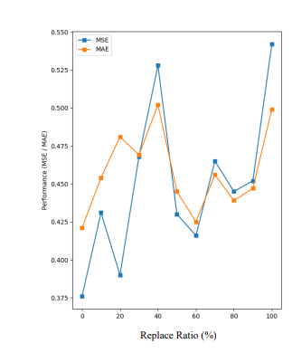

## 本周工作进展
1. 阅读论文
2. 看模型结构，运行数据集，修改Dataloader

### 1.代入Gold数据集
**pre_len = 96:**
   
**pre_len = 1:**

### 2.（2023 ICLR）TimesNet：Temporal 2D-Variation Modeling for General Time Series Analysis

本文创新：将一维时序数据扩展至二维空间进行分析，得到周期间和周期内两种时序变化
- **发掘时间序列周期性：**
  快速傅里叶变换（FFT），时域->频域

- **TmieBlock**

   1. 一维变换至二维：首先对输入的时序数据提取周期，转换为二维张量
   2. 提取二维时序变化
   
   3. 二维变换至一维：对提取的时序特征，将其转化回一维空间以便进行信息聚合
   
   4. 自适应融合：将得到的一维表征以其对应的频率强度进行加权求和，得到最终输出
   

- **Result**
 

### 3.（2023 NIPS）One Fits All: Power General Time Series Analysis by Pretrained LM

如上图所示，self-attention和FFN都被冻结，只训练positional embedding，input embedding，线性输出层，Layer Norm层。LLM的核心就在于self-attention和FFN，这些可以理解为通用的知识建模模型，而像embedding层这些都是特定于输入的，输入的域不同自然就要更换，要重新训练。

此外，在NLP里Input Embedding是由nn.Embedding模块来实现的，这是因为token是离散的。而在此处，是用nn.linear模块来实现的，就是为了适配输入维度。和LLMTime不同，LLMTime是直接把序列数字的一位或者多位给token化，而本文则是用了PatchTST提到的分Patch后得到token的方式。

**Connecting Self-Attention with PCA**
在本文中，作者也分析了为什么上面这种微调方式有用，为什么self-attention能作为一个通用的模块，冻结权重后还既能处理NLP文本，又能处理时间序列？作者证明了self-attention和PCA从作用上很相似，下面是一些直观的实验展示

作者将GPT模型中的预训练权重按照一定的比例替换为随机初始化的权重，如下图的横轴所示。当比例为0时，此时就是预训练好的GPT；当比例为100%时，此时就是随机初始化的GPT。理所应当的，替换比例为0时肯定预测效果最好（MSE、MAE最低）；替换比例为100%时随机初始化的权重相当于啥也没有，效果最差。

然后，作者又分析了token之间的相似度出发，对于每一层输出，计算token之间的两两相似度，可以得到相似度矩阵，有点类似于Attention Map。然后画出每层token的两两相似度值的直方图分布，如下图所示，横轴就是相似度，纵轴是成对token的数量。

如上图，可以看到，随机初始化的GPT的token相似度比较随意，而预训练的GPT，在较高的层数上，相似的token越来越多。这说明，可能所有token向量都被投影到了输入的低维特征向量空间中。为了验证这一想法，作者又将self-attention模块替换为PCA（主成分分析），发现算出的token相似度直方图和预训练的GPT得到的直方图很像。
因此，从实验上来看，self-attention和PCA的作用可以说是有些相似，这就说明了预训练好的self-attention建模各种模态数据的通用性。