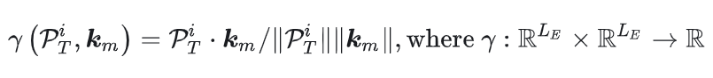
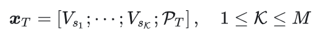
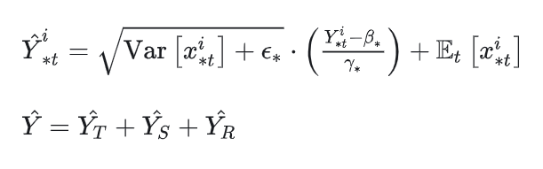
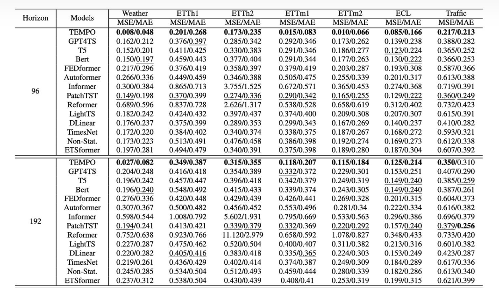

## 本周工作内容
1. 看论文
2. 看大模型微调的数据输入代码

**论文 TEMPO: PROMPT-BASED GENERATIVE PRE-TRAINED TRANSFORMER FOR TIME SERIES FORECASTING**

本文提出了一种基于提示选择的生成transformer，TEMPO。在预先训练的基于transformer的主干中引入提示池和季节性趋势分解的新颖集成，使模型能够基于不同时间语义组件的时间序列输入相似性，专注于从相关的过去时间段中适当地回忆知识。此外，还证明了TEMPO在多模态输入下的有效性，有效地利用了时间序列预测中的上下文信息。最后，通过大量的实验，我们强调了TEMPO在准确性、数据效率和泛化性方面的优势。

- **问题定义**
   多维时间序列预测任务的定义如下： 

   

   与常规的时序预测模型不同的是，这里参考语言模型在预测过程中为要预测的输入窗口添加了提示词

- **序列分解**
  
  将每个通道的变量都分解成如下形式：

  

  其中，i表示第i个通道的序列，趋势项可通过计算指定滑窗内的均值得到，即

  

  周期项是将原序列减去趋势项后通过Loess smoother计算得到
- **序列预处理**
  接下来对每个通道序列进行建模，通过上述分解每个通道的数据一分为三，这里作者采用的是patchTST（结构如下图所示）相同的预处理方式

  

  1. instance normalization：
  

   1. patching后得到的个数：
    

   2. 切分好的patch送入如下的embedding层进行编码：
   

  这里Tempo使用的backbone是预训练好的基于decoder层的GPT，编码能够将时序数据转化成大语言模型能理解的输入形式，而将原始数据分成不同的patch能够在保留局部语义的同时增大模型感受野。
- **Prompt设计**
  考虑到实际场景中时间序列数据通常具有非平稳特性（分布随时间不断变化），文章引入了一个共享的提示词集合，集合中保存了不同的键值对。理想情况下，相似的输入时间序列倾向于从集合中检索出同一组提示词，这将允许模型有选择性地回忆在单个时间序列实例层面最具代表性的提示，从而利用让模型更好地利用已有的经验知识。提示词记录了有关周期、趋势、时序相关性等相关的信息，定义如下：
  
  
  与注意力机制中的Key相同，与序列的编码得到的embbeding进行相似度计算，即：
  

  根据上述计算，将从提示词集合中找到k个与本序列相关的提示，并将提示词与原始序列的embedding进行拼接得到最终有关趋势项的输入：
  

  有关周期项和残差项的输入也是以相同方式构造，其中V采用端到端的训练方式

- **Backbone**
  使用基于解码器的生成预训练（transformerGPT）作为主干来构建时间序列表示的基础。将提示和不同的组件连接在一起，并将它们放入GPT中。在GPT内部，在训练期间冻结前馈层，选择更新位置嵌入层和层归一化层的梯度。
  

- **实验结果**
  

**大模型微调数据输入代码**

**DataLoader:**

    class Dataset_ETT_hour(Dataset):
    def __init__(self, root_path, flag='train', size=None,
                 features='S', data_path='ETTh1.csv',
                 target='OT', scale=True, timeenc=0, freq='h', 
                 seasonal_patterns=None, percent=10):
        # size [seq_len, label_len, pred_len]
        # info
        if size == None:
            self.seq_len = 24 * 4 * 4
            self.label_len = 24 * 4
            self.pred_len = 24 * 4
        else:
            self.seq_len = size[0]
            self.label_len = size[1]
            self.pred_len = size[2]

        # init
        assert flag in ['train', 'test', 'val']
        type_map = {'train': 0, 'val': 1, 'test': 2}
        self.set_type = type_map[flag]

        self.features = features
        self.target = target
        self.scale = scale
        self.timeenc = timeenc
        self.freq = freq

        self.percent = percent
        self.root_path = root_path
        self.data_path = data_path
        self.__read_data__()

    def __read_data__(self):
        self.scaler = StandardScaler()
        df_raw = pd.read_csv(os.path.join(self.root_path,
                                          self.data_path))

        border1s = [0, 12 * 30 * 24 - self.seq_len, 12 * 30 * 24 + 4 * 30 * 24 - self.seq_len]
        border2s = [12 * 30 * 24, 12 * 30 * 24 + 4 * 30 * 24, 12 * 30 * 24 + 8 * 30 * 24]
        border1 = border1s[self.set_type]
        border2 = border2s[self.set_type]

        if self.set_type == 0:
            border2 = (border2 - self.seq_len) * self.percent // 100 + self.seq_len

        if self.features == 'M' or self.features == 'MS':
            cols_data = df_raw.columns[1:]
            df_data = df_raw[cols_data]
        elif self.features == 'S':
            df_data = df_raw[[self.target]]

        if self.scale:
            train_data = df_data[border1s[0]:border2s[0]]
            self.scaler.fit(train_data.values)
            data = self.scaler.transform(df_data.values)
        else:
            data = df_data.values

        df_stamp = df_raw[['date']][border1:border2]
        df_stamp['date'] = pd.to_datetime(df_stamp.date)
        if self.timeenc == 0:
            df_stamp['month'] = df_stamp.date.apply(lambda row: row.month, 1)
            df_stamp['day'] = df_stamp.date.apply(lambda row: row.day, 1)
            df_stamp['weekday'] = df_stamp.date.apply(lambda row: row.weekday(), 1)
            df_stamp['hour'] = df_stamp.date.apply(lambda row: row.hour, 1)
            data_stamp = df_stamp.drop(['date'], 1).values
        elif self.timeenc == 1:
            data_stamp = time_features(pd.to_datetime(df_stamp['date'].values), freq=self.freq)
            data_stamp = data_stamp.transpose(1, 0)

        self.data_x = data[border1:border2]
        self.data_y = data[border1:border2]
        self.data_stamp = data_stamp

    def __getitem__(self, index):
        s_begin = index
        s_end = s_begin + self.seq_len
        r_begin = s_end - self.label_len
        r_end = r_begin + self.label_len + self.pred_len

        seq_x = self.data_x[s_begin:s_end]
        seq_y = self.data_y[r_begin:r_end]
        seq_x_mark = self.data_stamp[s_begin:s_end]
        seq_y_mark = self.data_stamp[r_begin:r_end]

        return seq_x, seq_y, seq_x_mark, seq_y_mark

    def __len__(self):
        return len(self.data_x) - self.seq_len - self.pred_len + 1

    def inverse_transform(self, data):
        return self.scaler.inverse_transform(data)
**DataFactory:**

    data_dict = {
        'ETTh1': Dataset_ETT_hour,
        'ETTh2': Dataset_ETT_hour
    }

    def data_provider(args, flag):
        Data = data_dict[args.data] #  根据数据集名称找到对应的类名处理数据
        timeenc = 0 if args.embed != 'timeF' else 1
        percent = args.percent

        if flag == 'test':
            shuffle_flag = False
            drop_last = True
            if args.task_name == 'anomaly_detection' or args.task_name == 'classification':
                batch_size = args.batch_size
            else:
                batch_size = 1  # bsz=1 for evaluation
            freq = args.freq
        else:
            shuffle_flag = True
            drop_last = True
            batch_size = args.batch_size  # bsz for train and valid
            freq = args.freq

        if args.data == 'm4':
            drop_last = False

         # 创建一个 Data 类的实例 data_set，根据传入的参数加载和处理数据。     
        data_set = Data(
            root_path=args.root_path,
            data_path=args.data_path,
            flag=flag,
            size=[args.seq_len, args.label_len, args.pred_len],
            features=args.features,
            target=args.target,
            timeenc=timeenc,
            freq=freq,
            seasonal_patterns=args.seasonal_patterns
        ) 
        batch_size = args.batch_size
        print(flag, len(data_set))

        # 创建 DataLoader 实例 data_loader，用于批量加载数据。
        data_loader = DataLoader(
            data_set,
            batch_size=batch_size,
            shuffle=shuffle_flag,
            num_workers=args.num_workers,
            drop_last=drop_last)
        return data_set, data_loader

**Model:**

    class Model(nn.Module):
        def __init__(self, configs):
        super(Model, self).__init__()
        self.is_ln = configs.ln
        self.task_name = configs.task_name
        self.pred_len = configs.pred_len
        self.seq_len = configs.seq_len
        self.patch_size = configs.patch_size
        self.stride = configs.stride
        self.seq_len = configs.seq_len
        self.d_ff = configs.d_ff
        self.patch_num = (configs.seq_len + self.pred_len - self.patch_size) // self.stride + 1 # 根据序列长度、预测长度、patch 大小和步长计算的 patch 数量。

        self.padding_patch_layer = nn.ReplicationPad1d((0, self.stride)) 
        self.patch_num += 1
        self.enc_embedding = DataEmbedding(configs.enc_in * self.patch_size, configs.d_model, configs.embed, configs.freq,
                                           configs.dropout)

        self.gpt2 = GPT2Model.from_pretrained('gpt2', output_attentions=True, output_hidden_states=True)
        self.gpt2.h = self.gpt2.h[:configs.gpt_layers]
        
        #冻结
        for i, (name, param) in enumerate(self.gpt2.named_parameters()):
            if 'ln' in name or 'wpe' in name: # or 'mlp' in name:
                param.requires_grad = True
            elif 'mlp' in name and configs.mlp == 1:
                param.requires_grad = True
            else:
                param.requires_grad = False

        if configs.use_gpu:
            device = torch.device('cuda:{}'.format(0))
            self.gpt2.to(device=device)

        # self.in_layer = nn.Linear(configs.patch_size, configs.d_model)

        if self.task_name == 'long_term_forecast' or self.task_name == 'short_term_forecast':
            self.predict_linear_pre = nn.Linear(self.seq_len, self.pred_len + self.seq_len)
            self.predict_linear = nn.Linear(self.patch_size, configs.enc_in)
            self.ln = nn.LayerNorm(configs.d_ff)
            self.out_layer = nn.Linear(configs.d_ff, configs.c_out)
        if self.task_name == 'imputation':
            self.ln_proj = nn.LayerNorm(configs.d_model)
            self.out_layer = nn.Linear(
                configs.d_model, 
                configs.c_out, 
                bias=True)
        if self.task_name == 'anomaly_detection':
            self.ln_proj = nn.LayerNorm(configs.d_ff)
            self.out_layer = nn.Linear(
                configs.d_ff, 
                configs.c_out, 
                bias=True)
        

    def forward(self, x_enc, x_mark_enc, x_dec, x_mark_dec, mask=None):
        if self.task_name == 'long_term_forecast' or self.task_name == 'short_term_forecast':
            dec_out = self.forecast(x_enc, x_mark_enc, x_dec, x_mark_dec)
            return dec_out[:, -self.pred_len:, :]  # [B, L, D]
        if self.task_name == 'imputation':
            dec_out = self.imputation(
                x_enc, x_mark_enc, x_dec, x_mark_dec, mask)
            return dec_out  # [B, L, D]
        if self.task_name == 'anomaly_detection':
            dec_out = self.anomaly_detection(x_enc)
            return dec_out  # [B, L, D]
        if self.task_name == 'classification':
            dec_out = self.classification(x_enc, x_mark_enc)
            return dec_out  # [B, N]
        return None

    def forecast(self, x_enc, x_mark_enc, x_dec, x_mark_dec):
        B, L, M = x_enc.shape
        
        # Normalization from Non-stationary Transformer
        means = x_enc.mean(1, keepdim=True).detach()
        x_enc = x_enc - means
        stdev = torch.sqrt(
            torch.var(x_enc, dim=1, keepdim=True, unbiased=False) + 1e-5)
        x_enc /= stdev

        # embedding
        enc_out = self.enc_embedding(x_enc, x_mark_enc)  # [B,T,C]
        enc_out = self.predict_linear_pre(enc_out.permute(0, 2, 1)).permute(
            0, 2, 1)  # align temporal dimension
        enc_out = torch.nn.functional.pad(enc_out, (0, 768-enc_out.shape[-1]))

        # enc_out = rearrange(enc_out, 'b l m -> b m l')
        # enc_out = self.padding_patch_layer(enc_out)
        # enc_out = enc_out.unfold(dimension=-1, size=self.patch_size, step=self.stride)
        # enc_out = self.predict_linear(enc_out)
        # enc_out = rearrange(enc_out, 'b m n p -> b n (m p)')

        dec_out = self.gpt2(inputs_embeds=enc_out).last_hidden_state
        dec_out = dec_out[:, :, :self.d_ff]
        # dec_out = dec_out.reshape(B, -1)
        
        # dec_out = self.ln(dec_out)
        dec_out = self.out_layer(dec_out)
        # print(dec_out.shape)
        # dec_out = dec_out.reshape(B, self.pred_len + self.seq_len, -1)
        
        # De-Normalization from Non-stationary Transformer
        dec_out = dec_out * \
                  (stdev[:, 0, :].unsqueeze(1).repeat(
                      1, self.pred_len + self.seq_len, 1))
        dec_out = dec_out + \
                  (means[:, 0, :].unsqueeze(1).repeat(
                      1, self.pred_len + self.seq_len, 1))
        
        return dec_out

Exp_Short_Term_Forecast:

    class Exp_Short_Term_Forecast(Exp_Basic):
    def __init__(self, args):
        super(Exp_Short_Term_Forecast, self).__init__(args)

    def _build_model(self):
        if self.args.data == 'm4':
            self.args.pred_len = M4Meta.horizons_map[self.args.seasonal_patterns]  # Up to M4 config
            self.args.seq_len = 2 * self.args.pred_len  # input_len = 2*pred_len
            self.args.label_len = self.args.pred_len
            self.args.frequency_map = M4Meta.frequency_map[self.args.seasonal_patterns]
        model = self.model_dict[self.args.model].Model(self.args).float()

        if self.args.use_multi_gpu and self.args.use_gpu:
            model = nn.DataParallel(model, device_ids=self.args.device_ids)
        return model

    def _get_data(self, flag):
        data_set, data_loader = data_provider(self.args, flag)
        return data_set, data_loader
    
        def train(self, setting):
        train_data, train_loader = self._get_data(flag='train')
        vali_data, vali_loader = self._get_data(flag='val')

        path = os.path.join(self.args.checkpoints, setting)
        if not os.path.exists(path):
            os.makedirs(path)

        time_now = time.time()

        train_steps = len(train_loader)
        early_stopping = EarlyStopping(patience=self.args.patience, verbose=True)

        model_optim = self._select_optimizer()
        criterion = self._select_criterion(self.args.loss)
        mse = nn.MSELoss()

        for epoch in range(self.args.train_epochs):
            iter_count = 0
            train_loss = []

            self.model.train()
