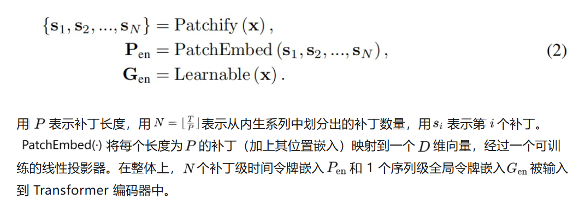

## 本周工作进展
1. 读论文
2. 跑代码
3. 学习时序数据嵌入方式


### TimeXier
由于现实应用中数据的部分观测性质，单纯关注感兴趣的目标变量（即内变量）通常不足以保证准确的预测。实际上，一个系统通常由多个变量组成，其中外变量（即与内变量无关的外部信息）可以为内变量提供有价值的外部信息。因此，本文关注一种更具实践性的情境：带外变量的时间序列预测。本文提出了一种新方法——TimeXer，通过引入外部信息来增强内变量的预测性能。通过精心设计的嵌入层，TimeXer 赋予传统的 Transformer 模型整合内生和外生信息的能力，其中同时采用了基于块的自注意力（patch-wise self-attention）和变量间交叉注意力（variate-wise cross-attention）。此外，TimeXer 学习了全局内生标记（endogenous tokens），以有效地将外生序列中的因果信息传递到内生时间片段中。
架构：
[](https://imgse.com/i/pEyP5A1)

Patch是一种基础模块，用于保留时间变化背后的语义信息。因此，注意力机制应用于patch，以挖掘复杂的时间模式。基于通道独立性的假设，PatchTST 及其后续模型能够捕捉时间依赖性，但在捕捉多变量相关性方面较弱。相比之下，面向变量的模型，如 iTransformer，通过将时间序列的每个变量视为一个单独的 token，并在多个变量 token 上应用注意力机制，成功推理了变量之间的相互关系。不幸的是，由于整个序列通过时间线性投影嵌入到一个粗粒度的变量 token 中，它们缺乏捕捉内部时间变化的能力。


[](https://imgse.com/i/pEyi3DJ)

**Endogenous Embedding**
 现有的大多数基于 Transformer 的预测模型将每个时间点或时间序列的一个片段嵌入为时间token，并应用自注意力来学习时间依赖性。为了精细捕捉内生变量中的时间变化，TimeXer 采用了Patch级表示。具体来说，内生系列被划分为不重叠的补丁，每个补丁被投影为一个时间token。鉴于内生变量和外生变量在预测中的不同作用，TimeXer 对它们采用了不同的粒度进行嵌入。因此，直接将不同粒度的内生令牌和外生令牌结合起来会导致信息对齐问题。为了解决这一问题，作者为每个内生变量引入了一个可学习的全局令牌，作为宏观表示与外生变量进行交互。该设计有助于将外生系列中的因果信息有效地传递到内生时间Patch中。整体的内生嵌入形式如下：


```
   class EnEmbedding(nn.Module):
	def __init__(self, n_vars, d_model, patch_len, dropout):
	    super(EnEmbedding, self).__init__()
	    # patch_len: 每个补丁的长度
	    # d_model: 嵌入维度
	    self.patch_len = patch_len
	    # 将 patch_len 维投影到 d_model 维，生成时间 token
	    self.value_embedding = nn.Linear(patch_len, d_model, bias=False)
	    # 全局可学习 token，初始化为 [1, n_vars, 1, d_model] 的随机值
	    self.glb_token = nn.Parameter(torch.randn(1, n_vars, 1, d_model))
	    # 位置嵌入，用于补充位置信息
	    self.position_embedding = PositionalEmbedding(d_model)
	    # Dropout 正则化
	    self.dropout = nn.Dropout(dropout)
	def forward(self, x):
	    # 输入维度 [B, V, L]
	    n_vars = x.shape[1]
	    # 全局令牌复制到每个 batch
	    glb = self.glb_token.repeat((x.shape[0], 1, 1, 1))
	    # 将时间序列划分为不重叠补丁 [B, V, N, patch_len]
	    x = x.unfold(dimension=-1, size=self.patch_len, step=self.patch_len)
	    # 展平为 [B*V, N, patch_len]
	    x = torch.reshape(x, (x.shape[0] * x.shape[1], x.shape[2], x.shape[3]))
	    # 通过线性投影生成时间 token [B*V, N, d_model]
	    x = self.value_embedding(x) + self.position_embedding(x)
	    # 恢复为 [B, V, N, d_model]
	    x = torch.reshape(x, (-1, n_vars, x.shape[-2], x.shape[-1]))
	    # 拼接全局令牌 [B, V, N+1, d_model]
	    x = torch.cat([x, glb], dim=2)
	    # 展平为 [B*V, N+1, d_model]
	    x = torch.reshape(x, (x.shape[0] * x.shape[1], x.shape[2], x.shape[3]))
	    # 应用 dropout
	    return self.dropout(x), n_vars
```

**Exogenous Embedding** 
外生变量的主要用途是促进内生变量的准确预测。不同变量之间的交互可以通过变量级表示更自然地捕捉，这种表示能够适应任意的不规则情况，例如缺失值、时间戳不对齐、不同的频率或不一致的回溯长度。相比之下，补丁级表示对外生变量来说过于细粒度，不仅会引入显著的计算复杂度，还会增加不必要的噪声信息。这些见解促使本文设计了每个外生系列都嵌入到一个系列级的变量令牌中，形式化表示为：
[](https://imgse.com/i/pEyit4x)

```
   
class DataEmbedding_inverted(nn.Module):
    def __init__(self, c_in, d_model, embed_type='fixed', freq='h', dropout=0.1):
        """
        DataEmbedding_inverted 模块将输入的时间序列数据和可选的时间戳信息嵌入到固定维度的特征空间。
        Args:
            c_in (int): 输入通道数，对应变量数。
            d_model (int): 嵌入后的目标特征维度。
            embed_type (str): 嵌入类型（未在本代码中使用）。
            freq (str): 时间频率（未在本代码中使用）。
            dropout (float): Dropout 的概率，用于防止过拟合。
        """
        super(DataEmbedding_inverted, self).__init__()
        # 定义线性层，用于将输入的变量数（c_in）映射到目标特征维度（d_model）
        self.value_embedding = nn.Linear(c_in, d_model)
        # Dropout 层，用于防止过拟合
        self.dropout = nn.Dropout(p=dropout)
    def forward(self, x, x_mark):
        """
        前向传播逻辑。
        Args:
            x (Tensor): 输入时间序列数据，形状为 [B, V, L]，
                        B 是批次大小，V 是变量数，L 是时间序列长度。
            x_mark (Tensor): 时间戳信息，可选，形状为 [B, V, L]。
        Returns:
            Tensor: 嵌入后的特征表示，形状为 [B, L, d_model]。
        """
        # 1. 调整输入维度，将形状从 [B, V, L] 转为 [B, L, V]，
        #    以匹配线性层的输入格式（Batch, Time, Variate）。
        x = x.permute(0, 2, 1)  # [B, V, L] -> [B, L, V]
        # 2. 如果提供了时间戳信息（x_mark），将其拼接到输入的变量维度上。
        if x_mark is not None:
            # 调整时间戳维度，并在变量维度上拼接
            x_mark = x_mark.permute(0, 2, 1)  # [B, V, L] -> [B, L, V]
            x = torch.cat([x, x_mark], dim=2)  # [B, L, V] + [B, L, V] -> [B, L, 2V]
        # 3. 通过线性层将变量数映射到目标特征维度 d_model
        #    如果没有时间戳，直接对 x 进行映射；如果有时间戳，对拼接后的数据映射。
        x = self.value_embedding(x)  # [B, L, V] or [B, L, 2V] -> [B, L, d_model]
        # 4. 应用 Dropout，随机失活部分神经元，防止过拟合
        x = self.dropout(x)
        # 返回嵌入后的特征表示
        return x
```

**Endogenous Self-Attention** 
为了实现准确的时间序列预测，发现内生变量中的内在时间依赖关系以及与外生变量的变量级表示之间的交互是至关重要的。除了对内生时间令牌进行自注意力（Patch-to-Patch），可学习的全局令牌还建立了内生变量与外生变量之间的桥梁。具体而言，全局令牌在交叉注意力中扮演不对称的角色：(1). Patch-to-Global：全局令牌对时间令牌进行注意力操作，以聚合整个序列的补丁级信息；(2). Global-to-Patch：每个时间令牌对全局令牌进行注意力操作，以接收变量级的相关性。这种机制提供了内生变量中时间依赖性的全面视角，同时与任意不规则的外生变量进行更好的交互。该注意力机制可以形式化为如下：
[](https://imgse.com/i/pEyiUC6)

**Exogenous-to-Endogenous Cross-Attention** 
交叉注意力在多模态学习中被广泛应用，用于捕捉不同模态之间的自适应令牌级依赖关系。在 TimeXer 中，交叉注意力层将内生变量作为查询（query），将外生变量作为键（key）和值（value），以建立两种变量之间的联系。由于外生变量被嵌入为变量级令牌，本文使用内生变量的学习到的全局令牌来聚合外生变量的信息。上述过程可以形式化为：
[](https://imgse.com/i/pEyia8K)

### 嵌入方式
首先，时序数据的编码综合了多个方面：

1. **特征嵌入（TokenEmbedding）**：原始输入特征通过一维卷积映射到d_model维度，捕获局部时间模式，同时进行特征转换。

2. **位置编码（PositionalEmbedding）**：为序列的每个位置生成一个固定的位置向量，让模型知道各个时间步的顺序信息。

3. **时间特征嵌入（TemporalEmbedding或TimeFeatureEmbedding）**：将时间相关的特征（如小时、星期几等）编码成向量。如果是离散的，使用FixedEmbedding（类似词嵌入）；如果是连续的，可能用线性层处理。

这些部分相加起来，形成最终的嵌入表示。例如，对于一个时间步，它的嵌入是特征嵌入的值加上位置编码，再加上时间特征的嵌入。

编码后的输入会被模型识别为一个三维张量，形状可能是(batch_size, sequence_length, d_model)，其中每个时间步被映射到d_model维的向量。这样，模型在处理每个时间步时，既考虑到了该位置的原始特征，又包含了时间顺序和时间相关的特征信息。

具体编码过程：

- 输入数据x的shape可能是(batch_size, seq_len, num_features)，其中num_features是每个时间步的特征数。

- TokenEmbedding将每个特征通过卷积转换成d_model维，因此每个时间步的特征向量变成d_model维。

- 位置编码为每个时间步的位置生成d_model维向量。

- 时间特征x_mark被编码成与位置编码相同的d_model维，然后相加。

- 最终的嵌入是三者相加的结果，然后经过Dropout。

向量化的方式：

- 原始时序数据可能包含多个变量（特征），每个时间步的特征通过卷积处理，转换为高维向量。

- 时间相关的特征（如月份、小时）被单独嵌入成向量，并加到主特征中。

- 位置编码提供顺序信息，使得模型能利用序列的位置关系。

总结来说，这段代码通过结合特征转换、位置编码和时间特征嵌入，将多变量的时序数据转换为适合Transformer等模型处理的高维向量表示。这种嵌入方式既保留了时间序列的时序关系，又融合了额外的时序特征，帮助模型更好地捕捉时间依赖关系。

**一些具体嵌入方法**

1. 傅里叶基嵌入（Fourier-based Embedding）
傅里叶基嵌入通过正弦和余弦函数将时间步映射到一个连续的高维空间，能够捕捉时间的周期性特征。


\[
\phi(t) = \left[ \cos\left(\frac{2\pi}{T_1} t\right), \sin\left(\frac{2\pi}{T_1} t\right), \dots, \cos\left(\frac{2\pi}{T_q} t\right), \sin\left(\frac{2\pi}{T_q} t\right) \right]
\]
其中，\( T_i \) 是周期参数，用于调整嵌入的频率。

```
import torch
import numpy as np

def fourier_embedding(t, periods):
    """
    t: 时间步
    periods: 周期列表
    """
    embedding = []
    for period in periods:
        embedding.append(np.cos(2 * np.pi * t / period))
        embedding.append(np.sin(2 * np.pi * t / period))
    return np.array(embedding)

# 示例
t = 10  # 时间步
periods = [10, 100, 1000]  # 周期
embedding = fourier_embedding(t, periods)
print(embedding)
``` 
2. 位置嵌入（Position Embedding）

位置嵌入通过正弦和余弦函数为每个位置分配一个固定的、预定义的向量。

\[
PE(pos, 2i) = \sin\left(\frac{pos}{10000^{2i/d_{\text{model}}}}\right)
\]
\[
PE(pos, 2i+1) = \cos\left(\frac{pos}{10000^{2i/d_{\text{model}}}}\right)
\]
其中，\( pos \) 是位置索引，\( i \) 是维度索引。
代码实现

```
import torch
import torch.nn as nn
import math

class PositionalEncoding(nn.Module):
    def __init__(self, d_model, max_len=5000):
        super(PositionalEncoding, self).__init__()
        pe = torch.zeros(max_len, d_model)
        position = torch.arange(0, max_len, dtype=torch.float).unsqueeze(1)
        div_term = torch.exp(torch.arange(0, d_model, 2).float() * (-math.log(10000.0) / d_model))
        pe[:, 0::2] = torch.sin(position * div_term)
        pe[:, 1::2] = torch.cos(position * div_term)
        pe = pe.unsqueeze(0).transpose(0, 1)
        self.register_buffer('pe', pe)

    def forward(self, x):
        x = x + self.pe[:x.size(0), :]
        return x
```

3. Patch Embedding
```
import torch
import torch.nn as nn

class PatchEmbedding(nn.Module):
    def __init__(self, patch_len, d_model):
        super(PatchEmbedding, self).__init__()
        self.patch_len = patch_len
        self.d_model = d_model
        self.linear = nn.Linear(patch_len, d_model)

    def forward(self, x):
        # x: (batch_size, seq_len)
        batch_size, seq_len = x.size()
        # 将时间序列分割成 patch
        patches = x.unfold(dimension=1, size=self.patch_len, step=self.patch_len)
        # patches: (batch_size, num_patches, patch_len)
        num_patches = patches.size(1)
        # 将每个 patch 嵌入到 d_model 维度
        patches = patches.contiguous().view(batch_size * num_patches, self.patch_len)
        embedded_patches = self.linear(patches)
        # embedded_patches: (batch_size * num_patches, d_model)
        embedded_patches = embedded_patches.view(batch_size, num_patches, self.d_model)
        return embedded_patches

# 示例使用
if __name__ == "__main__":
    batch_size = 2
    seq_len = 100
    patch_len = 10
    d_model = 32

    x = torch.randn(batch_size, seq_len)  # 输入时间序列
    patch_embedding = PatchEmbedding(patch_len, d_model)
    embedded_patches = patch_embedding(x)
    print("嵌入后的形状:", embedded_patches.shape)
```
4. 时间戳嵌入（Stamp Embedding）
时间戳嵌入将具体的时间信息（如小时、分钟等）编码成模型可以处理的向量表示。
数学公式
复制
\[
\text{Stamp Embedding}(t) = \left[ \text{SE}_{\text{hour}}(t), \text{SE}_{\text{minute}}(t) \right]
\]
其中，\( \text{SE}_{\text{hour}} \) 和 \( \text{SE}_{\text{minute}} \) 是可学习的嵌入向量。

```

import torch
import torch.nn as nn

class StampEmbedding(nn.Module):
    def __init__(self, num_hours, num_minutes, d_model):
        super(StampEmbedding, self).__init__()
        self.hour_embedding = nn.Embedding(num_hours, d_model)
        self.minute_embedding = nn.Embedding(num_minutes, d_model)

    def forward(self, hours, minutes):
        hour_embed = self.hour_embedding(hours)
        minute_embed = self.minute_embedding(minutes)
        return torch.cat((hour_embed, minute_embed), dim=-1)
```

5. 窗口嵌入（Window-Based Embedding）
窗口嵌入通过创建一个固定大小的滑动窗口，每个窗口包含连续的观测值，这些窗口用作建模的输入特征。
数学公式
复制
\[
\mathbf{x}(t) = \left[ x(t), x(t+1), \dots, x(t+w-1) \right]
\]
其中，\( w \) 是窗口大小。
```
import numpy as np

def window_embedding(x, w):
    """
    x: 时间序列
    w: 窗口大小
    """
    n = len(x)
    X = np.zeros((n - w + 1, w))
    for i in range(n - w + 1):
        X[i, :] = x[i:i+w]
    return X

# 示例
x = np.array([1, 2, 3, 4, 5, 6, 7, 8, 9, 10])  # 时间序列
w = 3  # 窗口大小
embedding = window_embedding(x, w)
print(embedding)
```

### 代码运行结果

[](https://imgse.com/i/pE6Sv8S)

[](https://imgse.com/i/pE6Sxgg)

**下周工作计划**
将TimeXier、TimesNet某些模块加入xlstm里尝试，对xlstm里的参数进行调优