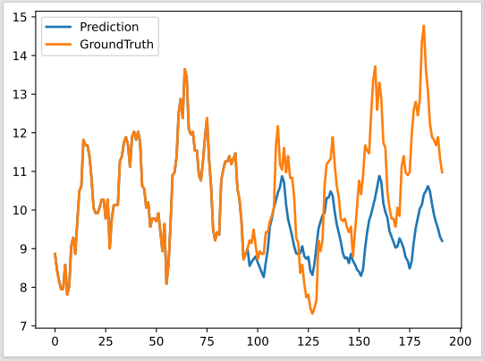
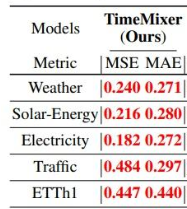
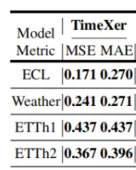

## 本周工作进展
1.运行TimeXer，TimeMixer代码
2.看模型代码结构





运行结果：(10 epoch，ETTh1)
TimeMixer：MSE:0.476,MAE：0.471
TimeXer : MSE 0.469,MAE:0.461
**TimeXer模型结构**
[](https://imgse.com/i/pEf1Uu8)

重点：

####  Cross Attention 在 TimeXer 中的作用与实现

TimeXer 使用 Cross Attention 将 **时间嵌入特征（temporal embedding）** 与主序列的表示融合，提升模型的时间建模能力。

---

#####  Cross Attention 是什么？

- **Self-Attention**：自己与自己做注意力（`Q = K = V = x`）
- **Cross-Attention**：两个序列之间做注意力（`Q = x1, K = V = x2`）

> Cross Attention 的目标是：用另一个序列的上下文，增强当前序列的表达。

---

###  Cross Attention 代码

```python
x_glb_attn = self.dropout(self.cross_attention(
    x_glb, cross, cross,
    attn_mask=cross_mask,
    tau=tau, delta=delta
)[0])
```

---


#### `x_glb` 
```python
x_glb_ori = x[:, -1, :].unsqueeze(1)
```
- 它取的是当前序列最后一个 patch 的输出，类似 `[CLS]` token，代表 **全局语义**
- Shape: `[B, 1, d_model]`

#### `cross` 

```python
ex_embed = self.ex_embedding(x_enc[:, :, :-1], x_mark_enc)
```
- 来源于时间戳 embedding 模块，包含周期/节奏等外部时间信息
- Shape: `[B, L, d_model]`

---

####  Cross Attention 是怎么做的？

```python
out, attn = self.cross_attention(Q, K, V)
```

使用 `AttentionLayer` 封装的 `FullAttention`，即：
```python
QW, KW, VW → Attention(QW, KW, VW) → Linear projection
```

等价于：
> 用 `x_glb` 查询 `cross`，找到哪些时间点的语义最重要，用来更新全局 token。

---

####  输出处理

```python
x_glb = x_glb_ori + x_glb_attn  # 残差连接
x_glb = self.norm2(x_glb)       # LayerNorm

x = torch.cat([x[:, :-1, :], x_glb], dim=1)  # 替换原来的 global token
```

- Cross Attention 更新后的 global token 替换原本的
- 最终结果用于后续 FFN 和 Flatten Head 层

#### FullAttention：
```python
class FullAttention(nn.Module):
    def __init__(self, mask_flag=True, factor=5, scale=None, attention_dropout=0.1, output_attention=False):
        super(FullAttention, self).__init__()
        self.scale = scale
        self.mask_flag = mask_flag
        self.output_attention = output_attention
        self.dropout = nn.Dropout(attention_dropout)

    def forward(self, queries, keys, values, attn_mask, tau=None, delta=None):
        # Shape unpacking 和缩放因子定义
        B, L, H, E = queries.shape
        _, S, _, D = values.shape
        scale = self.scale or 1. / sqrt(E)

        # 计算注意力分数
        scores = torch.einsum("blhe,bshe->bhls", queries, keys)

        if self.mask_flag:
            if attn_mask is None:
                attn_mask = TriangularCausalMask(B, L, device=queries.device)

            scores.masked_fill_(attn_mask.mask, -np.inf)

        A = self.dropout(torch.softmax(scale * scores, dim=-1))
        # 加权求值（注意力聚合）
        V = torch.einsum("bhls,bshd->blhd", A, values)

        if self.output_attention:
            return V.contiguous(), A
        else:
            return V.contiguous(), None
```