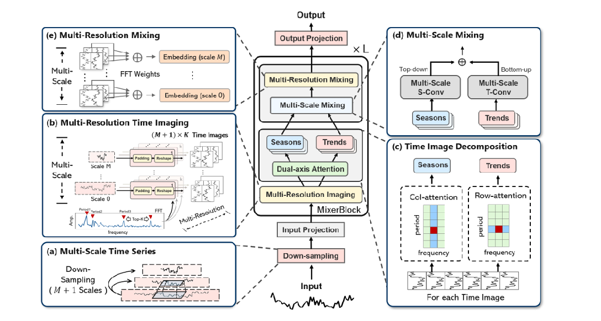

### 本周工作内容
1. TimeMixer模型架构
2. 看论文
3. 下载股票数据集，进行预测
### PERIODICITY DECOUPLING FRAMEWORK FOR LONG TERM SERIES FORECASTING

本文核心思想：

本文将时间序列分解为短期变化（short-term variations）和长期变化（long-term variations），然后分别对它们进行建模。短期变化就是每个周期内的波动；长期变化就是多个周期中相同阶段的变化，有点像趋势信息。

具体模型结构可看下图，总的思路就是，先用多周期解耦块（Multi-periodic Decoupling Block）将时间序列按照k个主要频率分解为k对长期变化和短期变化。然后将它们输入到双重变化建模模块（Dual Variations Modeling Block）中，对于每对长期变化和短期变化，用Transformer建模长期变化（Long-term Variations Extractor），用TCN建模短期变化（Short-term Variations Extractor），并将Transformer和TCN的结果相加，得到每个频率最终的结果。最后，将所有k个频率的结果拼接并线性变换（Variations Aggregation Block）就得到最终的输出。

**多周期解耦块（Multi-periodic Decoupling Block）**

如上图所示，多周期解耦块的作用是将序列分解为短期变化和长期变化。

首先用周期性提取器（Perodicity Extractor）提取主要频率，这一部分和TimesNet很像。
具体来说，用FFT将原始序列变换到频域，与TimesNet不同的是，作者认为不仅要考虑幅值强度最大的几个频率，还需要考虑频率取值最大的频率，因为前者反映了序列的主要组成部分，后者代表了序列的高频变化部分。接下来就是类似TimesNet的操作了，利用这些周期来将一维序列reshape成二维，就可以得到k个二维tensor。

 二维tensor的每一行其实就是一个周期period，也就是开头那张图的①②③④，然后每一列代表了所有period的相同位置，也就是开头那张图的空心点。

提取长期变化：将二维张量沿着时间维度分割成多个小块（patches），每个小块包含特定周期内的时间步长，然后将所有period中表示相同阶段的patch（对应开头那张图的蓝色的线）顺序拼接起来，得到的序列就是表示长期变化的序列。

提取短期变化：将二维tensor的每一行序列单独视作短期变化，沿着频率维度分割成多个一维短期切片，每个切片代表每个周期内的短期变化。

之后，将解耦出来的长期变化和短期变化输入到双重变化建模模块（Dual Variations Modeling Block）中。

**双重变化建模模块（Dual Variations Modeling Block）**
对于每个频率上解耦出来的长期变化和短期变化，分别利用Transformer和1D卷积来建模，将最后的结果相加即可，具体操作如下图所示：

最后，将k个频率周期的的结果拼接起来输入到一个线性层，即可得到最终的输出。

**实验**
在复杂度更低的同时效果更好：

### TIMEMIXER++: A GENERAL TIME SERIES PATTERN MACHINE FOR UNIVERSAL PREDICTIVE ANALYSIS

TimeMixer：

融合周期趋势分解、多尺度、频域分析、多通道相关性：

### 股票数据预测

