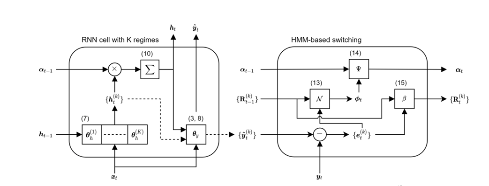

### 本周工作内容
1. Informer
2. 马尔科夫链
3. 马尔科夫链在时序预测的相关论文


### Informer

随着序列长度的增加，预测误差显著增加，同时预测速度急剧下降：

[](https://imgse.com/i/pE7Gxje)

- 存在下面三个问题：
1.self-attention机制的二次计算复杂度问题：self-attention机制的点积操作使每层的时间复杂度和内存使用量为 。
2.高内存使用量问题：对长序列输入进行堆叠时，J个encoder-decoder层的堆栈使总内存使用量为 ，这限制了模型在接收长序列输入时的可伸缩性。
3.预测长期输出的效率问题：Transformer的动态解码过程，使得输出变为一个接一个的输出，后面的输出依赖前面一个时间步的预测结果，这样会导致推理非常慢。


Informer模型，该模型具有三个显著特征:

1. 一种ProbSpare self-attention机制，它可以在时间复杂度和内存使用方面达到 O(Llog L) 。
2. self-attention蒸馏机制，通过对每个attention层结果上套一个Conv1D，再加一个Maxpooling层，来对每层输出减半来突出主导注意力，并有效地处理过长的输入序列。
3. 并行生成式解码器机制，对长时间序列进行一次前向计算输出所有预测结果而不是逐步的方式进行预测，这大大提高了长序列预测的推理速度。

模型架构：

[](https://imgse.com/i/pE7JSnH)

在上图左边为编码器，其编码过程为：编码器接收长序列输入（绿色部分），通过ProbSparse自注意力模块和自注意力蒸馏模块，得到特征表示。右边为解码器，解码过程为：解码器接收长序列输入（预测目标部分设置为0），通过多头注意力与编码特征进行交互，最后一次性直接预测输出目标部分（橙黄色部分）。

**01 高效的自注意力机制**

[](https://imgse.com/i/pE7B9HO)


该文作者通过实验验证了经典自注意力机制存在稀疏性，即自注意力特征图的长尾分布现象。具体为如下图所示，较少的点积贡献了绝大部分的注意力得分，也就是说其余部分的成对点积可以忽略。

[](https://imgse.com/i/pE7JJvF)
为了度量query的稀疏性，作者使用KL散度来计算query的attention概率分布与均匀分布的概率分布的相对熵，其中第i个query的稀疏性的评价公式是：
[](https://imgse.com/i/pE7Jtu4)
其中第一项是 对于所有的key的Log-Sum-Exp (LSE)，第二项是它们的算数平均值。

按照上面的评价方式，通过允许每个键key只关注 u 个支配性的query vectors来实现 ProbSparse self-attention，即：
[](https://imgse.com/i/pE7JNDJ)
通过该方法解决了Transformer的第一个问题，即：self-attention机制的二次计算复杂度问题。

**02 编码器**
编码器的设计目标为：在内存有限的情况下，通过注意力蒸馏机制，使得单个层级特征在时间维度减半，从而允许编码器处理更长的序列输入。
[](https://imgse.com/i/pE7JUb9)
编码器的主要功能是捕获长序列输入之间的长范围依赖。

作为ProbSpare自注意机制的结果，encoder的特征映射存在值V的冗余组合，因此，这里利用distilling操作对具有主导注意力的优势特征赋予更高权重，并在下一层生成focus self-attention特征映射。从j到j+1层的distilling操作的过程如下：

[](https://imgse.com/i/pE7JdER)

其中， 包含了multi-head probsparse self-attention以及在attention block中的关键操作。Conv1d表示时间序列上的一维卷积操作，并通过ELU作为了激活函数，最后再进行最大池化操作。

同时为了增强注意力蒸馏机制的鲁棒性，作者还构建了主序列的多个长度减半副本，每个副本是前一个副本长度的一半，这些副本序列和主序列经过同样的注意力蒸馏机制，从而构建多个长度为L/4的特征图。

最后将这些特征图拼接起来，构成输入编码器最终的特征图。

通过以上方法，可以逐级减少特征图的大小，在计算空间上不会耗费过多的内存，解决了Transformer的第二个问题：高内存使用量问题

**03 解码器**
解码器的设计目标为：通过一次前向计算，预测长序列的所有输出。

原始的解码器结构，即堆叠两个相同的多头注意力层，是一个动态解码过程，即一步一步进行迭代输出。不同的是，本文采用的是批量生成式预测直接输出多步预测结果。此外，喂进解码器的输入也有所不同：

[](https://imgse.com/i/pE7J04x)

该方法源于NLP技术中的动态解码，原本由单个字符作为“开始字符”，作者将其扩展为生成式方式，即从靠近预测目标的输入序列中动态采样部分序列作为“开始Token”。于是，通过多个output一起计算输出的方法，解决了Transformer在LSTF中的第三个问题：预测长期输出的效率问题。

**结果**
[](https://imgse.com/i/pE7JDC6)

### 马尔科夫链
过去所有的信息都已经被保存到了现在的状态，基于现在就可以预测未来。

**状态转移概率矩阵**

状态转移概率矩阵描述了系统从一个状态转移到另一个状态的概率。对于离散状态空间，该矩阵是一个方阵，其中元素 Pij  表示系统从状态i 转移到状态j 的概率。

**状态转移过程**

状态转移过程是指系统从一个状态到另一个状态的演变过程。通过不断迭代状态转移概率矩阵，可以模拟系统在不同时间步的状态变化。


**预测过程**

马尔科夫预测模型的核心思想是利用已知的状态序列来预测未来状态。通过观察现有的状态转移情况，可以估计状态转移概率，从而预测系统在未来的状态。这通常涉及到计算多步转移的概率，以确定系统在未来的可能状态。


**稳态分布**

在某些情况下，马尔科夫链可能收敛到一个稳态分布，即系统在各个状态上的概率分布趋于稳定。稳态分布对于理解系统长期行为和性质非常重要。
 ```
 python
# ---------------------------
# 1. 获取股价数据
# ---------------------------
stock = 'AAPL'
price_data = yf.download(stock, start='2020-01-01', end='2024-01-01')
prices = price_data['Close'].values

# 计算对数收益率
def calculate_log_returns(prices):
    return np.log(prices[1:] / prices[:-1])

returns = calculate_log_returns(prices)

# 计算涨跌状态 (涨:1, 跌:0)
def calculate_states(returns):
    return (returns > 0).astype(int)

states = calculate_states(returns)

# ---------------------------
# 2. 构造特征：收益率 + 涨跌状态 + 转移矩阵
# ---------------------------
window_size = 5
features = []
targets = []

for i in range(window_size, len(returns)-1):
    # 过去5天的收益率
    return_window = returns[i-window_size:i]
    
    # 过去5天的涨跌状态
    state_window = states[i-window_size:i]

    # 计算转移矩阵
    transition_matrix = np.zeros((2,2))
    for j in range(len(state_window)-1):
        from_state = state_window[j]
        to_state = state_window[j+1]
        transition_matrix[from_state, to_state] += 1

    # 避免除以0，加一个小epsilon
    epsilon = 1e-6
    row_sums = transition_matrix.sum(axis=1, keepdims=True) + epsilon
    transition_probs = transition_matrix / row_sums  # 每行归一化

    # 展平成一维
    transition_features = transition_probs.flatten()

    # 拼接成最终特征
    feature = np.concatenate([return_window, state_window, transition_features])
    target = returns[i]

    features.append(feature)
    targets.append(target)

features = torch.tensor(features, dtype=torch.float32)
targets = torch.tensor(targets, dtype=torch.float32).unsqueeze(1)
 ```

### Markovian RNN: An Adaptive Time Series Prediction Network with HMM-based Switching for Nonstationary Environments




**1. 模型结构**
Markovian RNN 是一种结合了循环神经网络（RNN）和隐马尔科夫模型（HMM）的时间序列预测模型，专门用于处理非平稳环境下的数据。模型包含多个内部状态（regime），每个状态都有独立的隐藏状态转换权重。HMM 用于控制这些状态之间的切换，从而适应数据的非平稳性。

- 状态的含义及作用：
  在Markovian RNN模型中，“状态”（State）是指模型内部用于区分和处理时间序列数据中不同动态模式的机制。具体来说，状态（或称为“regime”）是模型用来捕捉时间序列中不同阶段或模式的抽象表示。每个状态对应于时间序列中的一种特定动态特性或行为模式。

   **捕捉不同动态模式：**
在非平稳时间序列中，数据的统计特性（如均值、方差、相关性等）可能会随时间变化。例如，在金融市场中，股票价格可能在不同的经济周期（如牛市和熊市）中表现出不同的动态特性。
Markovian RNN通过引入多个状态，每个状态可以捕捉一种特定的动态模式。这样，模型能够更好地适应时间序列中的非平稳性。
**状态切换机制：**
模型使用隐马尔科夫模型（HMM）来控制状态之间的切换。状态切换是基于当前观测数据和状态转移概率矩阵（Ψ）来决定的。
状态信念（belief）表示当前时间步处于不同状态的概率。通过状态信念的更新机制，模型可以动态地调整当前的状态，从而更好地适应数据的变化。

**2. RNN 部分**
在传统的 RNN 中，隐藏状态 \( h_t \) 的更新公式为：
\[ h_t = f_h(h_{t-1}, x_t; \theta_h) = \tanh(W_{h h} h_{t-1} + W_{x h} x_t) \]
其中，\( f_h \) 是激活函数（如双曲正切函数 \(\tanh\)），\( W_{h h} \) 和 \( W_{x h} \) 是权重矩阵。

在 Markovian RNN 中，每个状态 \( k \) 都有一个独立的隐藏状态更新公式：
\[ h_t^{(k)} = f_h(h_{t-1}^{(k)}, x_t; \theta_h^{(k)}) = \tanh(W_{h h}^{(k)} h_{t-1}^{(k)} + W_{x h}^{(k)} x_t) \]
最终的隐藏状态 \( h_t \) 是所有状态隐藏状态的加权平均：
\[ h_t = \sum_{k=1}^K \alpha_{t-1, k} h_t^{(k)} \]
其中，\( \alpha_{t-1, k} \) 是状态 \( k \) 的信念值。

**3. HMM 部分**
HMM 用于控制状态之间的切换。状态信念值 \( \alpha_t \) 表示当前时间步 \( t \) 处于不同状态的概率。信念值的更新公式为：
\[ \alpha_t \propto \phi_t \odot (\Psi^T \alpha_{t-1}) \]
其中，\( \phi_t \) 是似然向量，表示在每个状态下观测到当前数据的概率；\( \Psi \) 是状态转移矩阵。

对于均方误差损失，假设误差模型服从高斯分布：
\[ y_t = \hat{y}_t^{(k)} + e_t^{(k)} \]
\[ e_t^{(k)} \sim N(0, R_{t-1}^{(k)}) \]
似然值计算公式为：
\[ p(y_t \mid k_t = k) = \frac{1}{\sqrt{(2\pi)^{n_y} |R_{t-1}^{(k)}|}} \exp\left(-\frac{1}{2} e_t^{(k)^T} R_{t-1}^{(k)^{-1}} e_t^{(k)}\right) \]
误差协方差矩阵 \( R_t^{(k)} \) 的更新公式为：
\[ R_t^{(k)} = (1 - \beta) R_{t-1}^{(k)} + \beta e_t^{(k)} e_t^{(k)^T} \]
其中，\( \beta \) 是平滑参数，控制对新误差的敏感度。


 **自适应切换**：通过 HMM 的状态信念机制，模型能够自适应地在不同状态之间切换，从而适应数据的非平稳性。能够有效地捕捉复杂的时间模式并适应数据的动态变化。

**示例**
假设我们有一个金融时间序列数据，其中包含两个状态：
状态1：市场处于牛市，股票价格呈上升趋势。
状态2：市场处于熊市，股票价格呈下降趋势。
Markovian RNN可以通过状态信念和状态切换机制，动态地识别当前市场处于哪个状态，并调整模型的预测策略。例如，当市场从牛市切换到熊市时，模型会通过状态信念的更新，增加对状态2的权重，从而更好地适应市场变化。