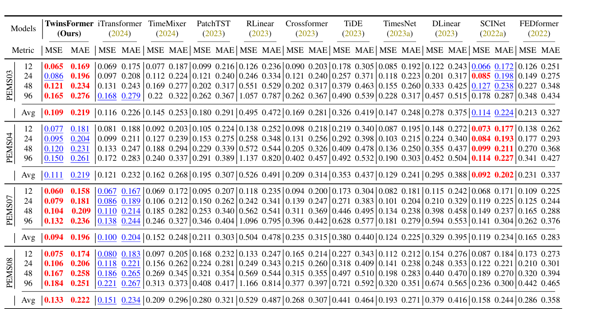

### 本周工作内容
1. 找数据集
2. 因果发现
3. 读论文

### 1. 数据集：（2010-2024）
股票市场（S&P 500、Nasdaq 100）、宏观经济指标（利率、CPI每月消费者价格指数、GDP）、外汇市场（USD/CHF、EUR/USD）以及商品市场（黄金、白银、铂金、钯金、石油等）。
[](https://imgse.com/i/pEX4gnx)

### 2.因果发现
```
在一个数据系统中，对于 2 个变量，如果保持其他机制不变，
改变一个变量会使得另一个变量也发生改变，则称前者为因，后者为果，两者之间存在因果关系。
```
**相关性并不意味着因果关系（ correlation does not imply causation ）**

因果分析典型任务：
因果发现（causal discovery）：从观测数据中了解一系列变量之间的潜在因果结构/关系。

格兰杰因果发现（Granger Causality）

---

**基本概念**
格兰杰因果发现（Granger Causality）是一种基于统计的时间序列因果关系检验方法，其核心思想是：  
> 如果变量X的历史信息能够显著提高对变量Y未来值的预测能力，则称X是Y的格兰杰原因（Granger-cause）。

• 注意：  

  • 格兰杰因果是统计意义上的预测关系，而非哲学或物理意义上的真实因果关系。  

  • 它反映的是变量间的领先-滞后关系（X的过去值影响Y的未来值）。


---

**数学原理**
**1. 基础模型**
• 原假设（H₀）：X不是Y的格兰杰原因。  

• 备择假设（H₁）：X是Y的格兰杰原因。


**2. 检验步骤**
1. 构建两个自回归模型：  
   • 受限模型（Restricted Model）：仅用Y的历史值预测Y的未来值。  

     \[
     Y_t = \alpha + \sum_{i=1}^p \beta_i Y_{t-i} + \epsilon_t
     \]
   • 非受限模型（Unrestricted Model）：加入X的历史值作为预测因子。  

     \[
     Y_t = \alpha + \sum_{i=1}^p \beta_i Y_{t-i} + \sum_{j=1}^q \gamma_j X_{t-j} + \epsilon_t
     \]

2. 假设检验：  
   • 使用F检验或似然比检验（Likelihood Ratio Test）比较两个模型的预测能力。  

   • 若非受限模型的预测误差显著小于受限模型，则拒绝原假设，认为X是Y的格兰杰原因。


---

**实施流程**
1. 数据准备：  
   • 确保时间序列平稳性（通过ADF检验或差分处理）。  

   • 选择合理的滞后阶数（p, q）（可通过AIC/BIC准则优化）。


2. 代码：  
   ```python
   from statsmodels.tsa.stattools import grangercausalitytests

   # 假设data为包含两列（X和Y）的DataFrame
   granger_test = grangercausalitytests(data[['Y', 'X']], maxlag=5)  # 测试1到5阶滞后

   # 输出结果解读：
   # 对每个滞后阶数，检查p值。若p<0.05，拒绝原假设。
   ```

3. 结果解读：  
   • P值<显著性水平（如0.05） → X是Y的格兰杰原因。  

   • P值≥显著性水平 → 无法拒绝原假设，X不是Y的格兰杰原因。


---


**缺点**：
1. 线性假设：默认使用线性自回归模型，无法捕捉非线性关系。  
2. 滞后阶数敏感：结果依赖于滞后阶数的选择。  


---


[](https://imgse.com/i/pEX47jI)


 **编码器中的因果分析**
- **提取外生变量**：编码器的任务是从观测数据中提取外生变量，这些外生变量可以理解为数据中无法被其他变量解释的部分，即数据中的异常或干预因素。通过模拟归纳推理过程，编码器推导出每个时间序列的外生变量。
- **独立性约束**：为了确保外生变量之间的独立性，编码器的输出被约束为遵循标准高斯分布。这一步骤通过 KL 散度来量化外生变量的分布与标准高斯分布之间的差异，并将其作为损失函数的一部分。这种独立性约束有助于确保提取的外生变量能够准确反映数据中的因果关系。

 **解码器中的因果分析**
- **重构观测数据**：解码器通过模拟演绎推理过程，从外生变量和过去的观测数据中重构当前时间步的观测数据。解码器的设计基于格兰杰因果关系，即当前时间步的观测数据可以通过过去时间步的观测数据和当前时间步的外生变量来表示。
- **格兰杰因果关系建模**：解码器通过神经网络预测过去时间步的观测数据对当前时间步的影响，从而建模时间序列之间的格兰杰因果关系。这种建模方式使得解码器能够捕捉时间序列之间的动态依赖关系。


### 3.论文：（2025ICLR）TWINSFORMER: REVISITING INHERENT DEPENDENCIES VIA TWO INTERACTIVE COMPONENTS FOR TIME SERIES FORECASTING


TwinsFormer 在注意力模块和前馈网络周围设计了交互策略，以加强通过分解组件捕获的依赖关系。具体而言，它采用双流策略，促进趋势和季节性组件之间的渐进和隐式信息交互。通过这种方式，TwinsFormer 避免了模型忽视不同组件之间的固有依赖关系，从而实现更准确的预测。

**TwinsFormer 框架**：
- **双流结构**：TwinsFormer 采用编码器架构，将 Transformer 改进为具有两个分解组件的双流结构。在将时间序列嵌入之前，先将其分解为趋势（T）和季节性（S）组件。
- **交互模块**：该模块是 TwinsFormer 的关键设计，它允许模型学习和聚合趋势和季节性信息的有效表示。季节性分支将季节性嵌入传递给注意力模块和前馈网络，而趋势分支则在交互模块的监督下学习趋势表示。
- **残差学习和交互学习**：通过残差学习机制，从季节性分支中减去注意力和前馈网络模块的输出，以纠正冗余编码。同时，利用交互模块中的多尺度卷积和门控机制，将季节性信息融合到趋势分支中，从而更好地捕获时间序列的固有依赖关系。
[](https://imgse.com/i/pEX59vn)

1. **时间序列分解**：
   \[
   X_T = \text{AvgPool}(\text{Padding}(X)), \quad X_S = X - X_T
   \]
   其中，\(X_T\) 和 \(X_S\) 分别表示趋势和季节性组件。

2. **嵌入层**：
   \[
   E_T = \text{Dropout}(\text{Linear}(\text{Concat}(X_T, X_{\text{mark}}))), \quad E_S = \text{Dropout}(\text{Linear}(\text{Concat}(X_S, X_{\text{mark}})))
   \]
   这里，\(E_T\) 和 \(E_S\) 分别是趋势和季节性组件的嵌入表示。

3. **季节性分支**：
   \[
   H_1 = \text{LayerNorm}(E_S - A_S), \quad H_2 = H_1 - \text{FFN}(H_1)
   \]
   其中，\(A_S\) 是通过注意力机制得到的季节性表示。通过从输入中减去注意力模块和 FFN 的输出，减少冗余编码，从而更好地捕捉时间序列的固有模式。

4. **趋势分支**：
   \[
   E'_T = \text{Sigmoid}(\text{Conv1×1}(\text{Multiconv}(A_S))) \cdot E_T, \quad F_T = \text{Concat}(A_S, F_S, E'_T)
   \]
   这里，\(E'_T\) 是通过交互模块更新的趋势嵌入。

5. **门控机制**：
   \[
   O_S = \text{Sigmoid}(\text{Conv1}(H_2)) \cdot \text{Conv2}(H_2), \quad O_T = \text{Sigmoid}(\text{Conv3}(F_T)) \cdot \text{Conv4}(F_T)
   \]
   门控机制用于调节信息传输的速度。

6. **最终预测**：
   \[
   Y = \text{Projection}(O_S + O_T)
   \]
   通过线性投影将季节性和趋势表示合并，生成最终的预测结果。


**下周工作目标**
   1. 处理数据（时间对齐；月度/季度->日度、标准化；处理缺失值）
   2. 因果发现方法选择

