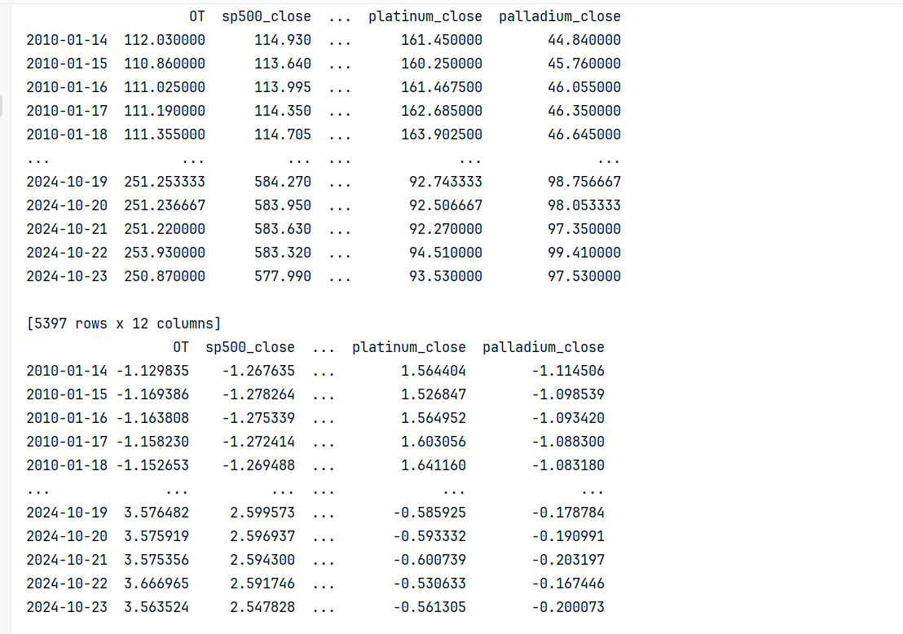
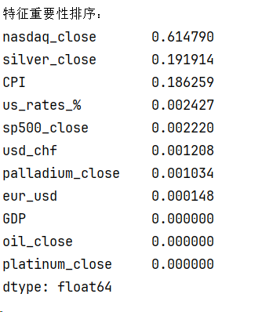
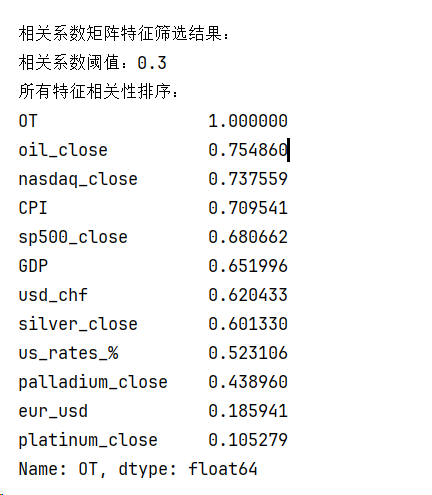
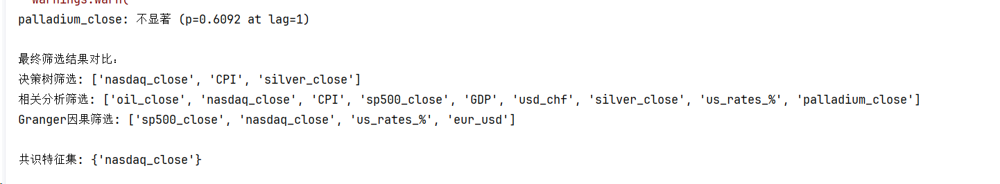
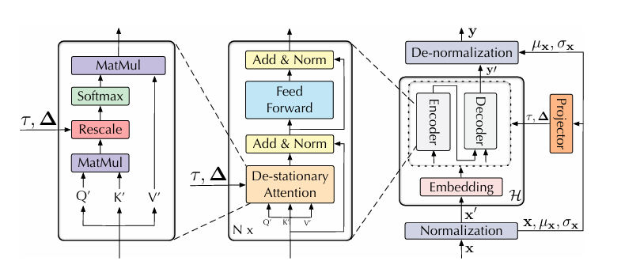

### 本周工作内容
1. 对数据进行预处理（数据对齐，处理缺失值，标准化）以及通过不同的方法选协变量
2. 针对非平稳数据的论文
   
对数据进行处理：

协变量选择：

#### NeurIPS2022 | NSTransformers: 非平稳时间序列的通用预测框架

Transformer中的点到点的注意力机制天然适合建模时间序列中的时序依赖（Temporal Dependency），可堆叠的编解码器也利于捕捉和聚合不同时间尺度下的时序特征。

针对非平稳时序预测问题，以往的研究旨在利用平稳化技术消除数据在时间维度上的分布差异，以提高数据本身的可预测性。然而基于大量的实验观察，在平稳化后的数据上进行模型训练会限制Transformer建模时序依赖的能力，导致模型仅能学到不易区分的注意力图与较弱的时序依赖，从而产生平稳性过高的预测输出与较大的预测误差，称之为过平稳现象（Over-stationarization）。

针对非平稳时序预测问题，文章提出了“Non-stationary Transformers”框架，包含两个关键模块：**Series Stationarization（序列平稳化）** 和 **De-stationary Attention（非平稳注意力）**。
模型架构：

#### Series Stationarization（序列平稳化）

该模块通过标准化每个输入序列的统计特性（如均值和标准差），将数据转换为更平稳的分布，从而提高模型的泛化能力。具体来说，对于每个输入序列 \( x = [x_1, x_2, \dots, x_S] \)，通过以下步骤进行平稳化：

1. **计算均值和标准差**：
   \[
   \mu_x = \frac{1}{S} \sum_{i=1}^{S} x_i, \quad \sigma_x = \sqrt{\frac{1}{S} \sum_{i=1}^{S} (x_i - \mu_x)^2}
   \]
2. **标准化**：
   \[
   x'_i = \frac{x_i - \mu_x}{\sigma_x}
   \]
3. **反标准化**：在模型输出后，将预测结果恢复到原始的统计特性：
   \[
   \hat{y}_i = \sigma_x \cdot y'_i + \mu_x
   \]

归一化作为一种平稳化技术，虽然增强了数据的可预测性，但也对原本的数据分布造成了不可逆转的退化。因此在第一阶段中我们还存储了各个窗口内序列原本的均值和方差，在第二阶段中用这些统计量重新对模型的输出进行反向尺度变换，以恢复其归一化时丢失的分布信息。
#### De-stationary Attention（非平稳注意力）

该模块解决过度平稳化（over-stationarization）问题，即直接平稳化时间序列会削弱模型对原始序列中非平稳信息的学习能力。文章通过分析Transformer的自注意力机制，提出了一种新的注意力机制，能够重新引入原始序列的非平稳信息。
使用经过归一化后的输入和归一化时存储的统计量，以近似未归一化时原始输入时本应得到的注意力图。根据Transformer的注意力计算公式：

\[ \text{Attn}(Q, K, V) = \text{Softmax}\left(\frac{QK^\top}{\sqrt{d_k}}\right)V \]

其中，\( Q \)、\( K \) 和 \( V \) 分别是查询（query）、键（key）和值（value），\( d_k \) 是键的维度。

**序列平稳化时的尺度变换公式（\( S \)为序列长度）**

\[ \mu_x = \frac{1}{S} \sum_{i=1}^{S} x_i, \sigma_x^2 = \frac{1}{S} \sum_{i=1}^{S} (x_i - \mu_x)^2 \]

\[ x'_i = \frac{1}{\sigma_x} \odot (x_i - \mu_x) \]

基于模型嵌入层（Embedding）和前向传播层（FFN）在时间维度的线性假设，可导出注意力层的输入 \( Q \), \( K \) 分别满足：

\[ Q' = \frac{Q - 1\mu_Q^\top}{\sigma_x}, K' = \frac{K - 1\mu_K^\top}{\sigma_x} \]

其中 \(\mu_Q, \mu_K\) 对应在时间维的 \(Q, K\) 均值，\(\sigma_x\) 为原始输入的方差。带入注意力计算公式，我们有：

\[
\text{Softmax}\left(\frac{QK^\top}{\sqrt{d_k}}\right) = \text{Softmax}\left(\frac{\sigma_x^2 Q'K'^\top + 1(\mu_Q^\top K^\top) + (Q\mu_K)1^\top - 1(\mu_Q^\top \mu_K)1^\top}{\sqrt{d_k}}\right)
\]

其中 \(1 \in \mathbb{R}^{S \times 1}\) 为全1向量，根据Softmax算子的平移不变性，上述公式可简化为：

\[
\text{Softmax}\left(\frac{QK^\top}{\sqrt{d_k}}\right) = \text{Softmax}\left(\frac{\sigma_x^2 Q'K'^\top + 1\mu_Q^\top K^\top}{\sqrt{d_k}}\right)
\]

其中，\( Q', K' \) 是平稳化后的查询和键，而 \( \sigma_x \) 和 \( \mu_Q \) 是非平稳信息。为了近似这些非平稳信息，文章使用一个多层感知机（MLP）来学习两个去平稳化因子 \( \tau \) 和 \( \Delta \)：
\[
\log \tau = \text{MLP}(\sigma_x, x), \quad \Delta = \text{MLP}(\mu_x, x)
\]
然后，非平稳注意力机制定义为：
\[
\text{Attn}(Q', K', V', \tau, \Delta) = \text{Softmax}\left(\tau Q'K'^\top + \Delta^\top\right) V'
\]

### 实验

文章在六个真实世界的时间序列数据集上进行了广泛的实验，包括Electricity、ETT、Exchange、ILI、Traffic和Weather。实验结果表明，Non-stationary Transformers框架能够显著提升Transformer及其变体的性能，具体表现如下：

- 在Exchange数据集上，Non-stationary Transformer在预测长度为336时，MSE降低了17%。
- 在ILI数据集上，预测长度为336时，MSE降低了25%。
- 在ETTm2数据集上，预测长度为336时，MSE降低了26.7%。

此外，文章还验证了该框架对Transformer、Informer、Reformer和Autoformer等模型的普适性，平均MSE降低分别为49.43%、47.34%、46.89%和10.57%。
