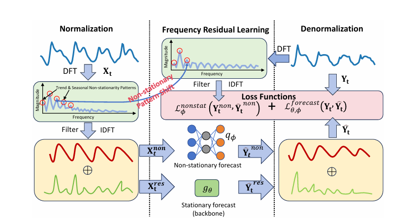

### 本周工作内容
1. 对数据进行平稳性检验
2. 对模型超参数进行优化
3. 读论文

#### 非平稳性检验方法：
单位根检验统计检验方法有ADF检验、PP检验、NP检验。最常用的是ADF检验。
- ADF检验的原理
ADF检验就是判断序列是否存在单位根：如果序列平稳，就不存在单位根；否则，就会存在单位根。
- ADF检验的假设
H0 假设就是存在单位根，如果得到的显著性检验统计量P值小于三个置信度（10%，5%，1%），则对应有（90%，95，99%）的把握来拒绝原假设。

#### 模型参数优化工具：Optuna

Optuna是一个基于贝叶斯优化的超参数优化框架。它的目标是通过智能的搜索策略，尽可能少的实验次数找到最佳超参数组合。

优势：
1. 智能搜索策略： Optuna使用TPE（Tree-structured Parzen Estimator）算法进行贝叶斯优化，能够更智能地选择下一组实验参数，从而加速超参数搜索。
2. 轻量级： Optuna的设计简单而灵活，易于集成到现有的机器学习项目中。
3. 可视化支持： 提供结果可视化工具，帮助用户直观地了解实验过程和结果。
4. 并行优化： Optuna支持并行优化，能够充分利用计算资源，提高搜索效率。

劣势：
适用范围： 对于超参数空间较小或者问题较简单的情况，Optuna的优势可能不如其他方法显著。

#### Frequency Adaptive Normalization For Non-stationary Time Series Forecasting

FAN方法的核心思想是通过傅里叶变换去除输入中的主要频率成分，从而使预测模型能够专注于平稳部分。

1. **傅里叶变换与频率残差学习（Frequency Residual Learning, FRL）**  
   对于输入时间序列 \(X_t \in \mathbb{R}^{L \times D}\)，其中 \(L\) 是时间步长，\(D\) 是特征维度，FAN首先对每个维度进行一维离散傅里叶变换（DFT）：
   \[
   Z_t = \text{DFT}(X_t)
   \]
   然后选择振幅最大的前 \(K\) 个频率成分：
   \[
   K_t = \text{TopK}(\text{Amp}(Z_t))
   \]
   并通过滤波操作去除这些频率成分：
   \[
   X^{\text{non}}_t = \text{IDFT}(\text{Filter}(K_t, Z_t))
   \]
   其中，\(\text{IDFT}\) 是逆傅里叶变换，\(\text{Filter}\) 是去除特定频率成分的操作。

2. **归一化与去归一化**  
   通过从输入中减去 \(X^{\text{non}}_t\)，得到平稳部分 \(X^{\text{res}}_t\)：
   \[
   X^{\text{res}}_t = X_t - X^{\text{non}}_t
   \]
   预测模型 \(g_\theta\) 接收 \(X^{\text{res}}_t\) 作为输入，并预测输出的平稳部分 \(Y^{\text{res}}_t\)：
   \[
   \hat{Y}^{\text{res}}_t = g_\theta(X^{\text{res}}_t)
   \]
   最后，通过将去除的非平稳信息加回到输出中，得到最终预测结果：
   \[
   \hat{Y}_t = \hat{Y}^{\text{res}}_t + \hat{Y}^{\text{non}}_t
   \]
   其中，\(\hat{Y}^{\text{non}}_t\) 是通过一个简单的多层感知机（MLP）模型 \(q_\phi\) 预测的非平稳信息：
   \[
   \hat{Y}^{\text{non}}_t = q_\phi(X^{\text{non}}_t, X_t) = W_3 \text{ReLU}(W_2 \text{Concat}(\text{ReLU}(W_1 X^{\text{non}}_t), X_t))
   \]

3. **损失函数**  
   为了优化模型，定义了两个损失函数：
   \[
   \mathcal{L}^{\text{nonstat}}_\phi(Y^{\text{non}}_t, \hat{Y}^{\text{non}}_t) + \mathcal{L}^{\text{forecast}}_{\theta,\phi}(Y_t, \hat{Y}_t)
   \]
   其中，\(\mathcal{L}^{\text{nonstat}}_\phi\) 是预测非平稳成分的均方误差损失，\(\mathcal{L}^{\text{forecast}}_{\theta,\phi}\) 是整体预测的均方误差损失。

#### 实验

#### 结论
本文提出的FAN方法通过傅里叶变换去除输入中的主要频率成分，并通过MLP模型预测非平稳信息的变化，从而显著提高了非平稳时间序列预测的性能。实验结果表明，FAN在多个基准数据集上均优于现有的归一化方法。未来的工作可以集中在自动选择最优的 \(K\) 值以及进一步提高模型对非平稳模式的适应性。
