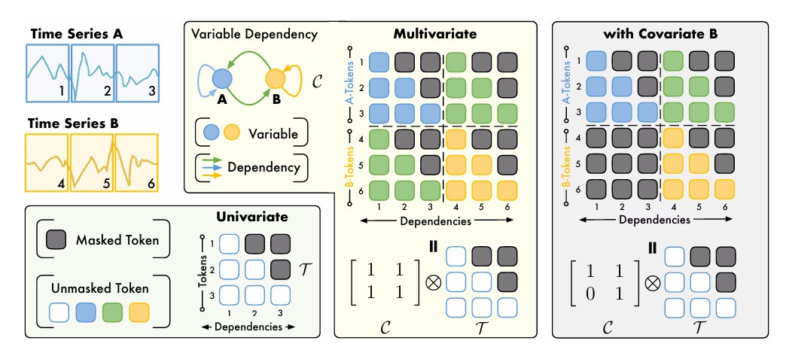
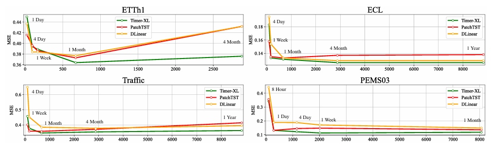
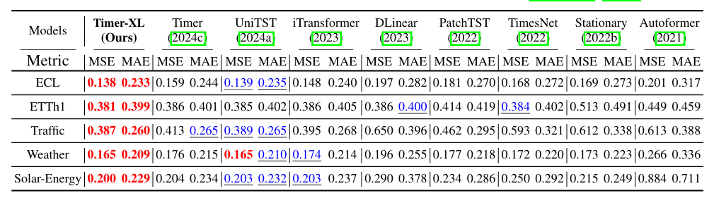
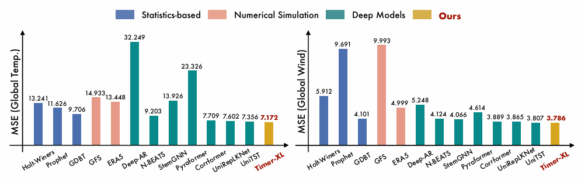

#### （ICLR2025）TIMER-XL: LONG-CONTEXT TRANSFORMERS FOR UNIFIED TIME SERIES FORECASTING

长上下文Transformer 统一的时间序列预测。

- 长文本：NLP领域的Transformer学习成千上万的token间依赖，传统只能学几百个token。
- 统一预测：做出改变：1维的token 预测 下一个token 改成→ 2维的(多变量)。 

类似NLP中的语言模型 ，Timer-XL使用了Next Token Prediction任务进行模型训练。在语言模型中，Next Token Prediction任务的目标是根据前面的token，预测下一个token是什么。在时间序列中，Time-XL将token定义为一个窗口内的时间序列，也就是一个patch作为一个token。优化的目标就变成了预测下一个patch的时间序列，以MSE为目标进行拟合。

上述方式只适用于单变量时间序列。为了扩展到多变量时间序列，Timer-XL采用了多元Next Token Prediction的建模方式。整体可以理解为，每个变量仍然独立的预测下一个token，但是会根据所有变量的历史序列来预测各个变量的下一个token，公式可以表示为如下形式：

\[
P(\mathbf{X}) = \prod_{m = 1}^{N} \prod_{i = 1}^{T} p(\mathbf{x}_{m, i + 1} | \mathbf{x}_{:, \leq i}) = \prod_{m = 1}^{N} \prod_{i = 1}^{T} p(\mathbf{x}_{m, i + 1} | \mathbf{x}_{1, \leq i}, \ldots, \mathbf{x}_{N, \leq i})
\]

通过这种多变量Next Token Prediction的扩展，模型可以同时建模序列关系和变量间关系，实现了从1D建模到2D建模的扩展。 
模型：使用decoder-only的Transformer，利用不同长度的上下文来捕捉因果依赖关系。

-  因果（Causality）通常指的是模型在处理序列数据时，只能使用当前时间点之前的信息，而不能“看到”未来的信息。

- 通过“自注意力”和“因果掩码”实现。
使用**因果掩码（Causal Masking）**： 在计算**注意力权重（Attention Weights**时，对未来的时间步置零，使得模型在计算第 ttt 个时间步的预测时，只能看到时间步 ≤t\leq t≤t 的数据。
**解码器架构（Decoder-Only Architecture）**： 采用自回归（Autoregressive） 方式进行预测，即模型逐步预测每个时间步的值，并将已预测的值输入到后续时间步的计算中，而不是一次性输出整个序列。

创新：1.提出了通用的TimeAttention机制；2.位置编码。
模型结构：

### Kronecker 乘积 $C \otimes T$
变量依赖矩阵(时间因果) $C$ 与时间掩码 $T$ 通过 Kronecker 乘积，将变量间的依赖关系 ($C$) 和时间序列的因果结构 ($T$) 结合，形成一个完整的 **注意力掩码（Attention Mask）** 。保证 Transformer 既能考虑时间因果性，又能捕获变量之间的相互影响。

### RoPE 旋转位置编码
旨在为Transformer模型提供相对位置信息。

$RoPE(Q, K) = QR_{\theta}K^{T}$

其中，$R_{\theta}$ 是一个基于位置索引 $p$ 和一个预设的基数 $\theta$ 生成的旋转矩阵。

==RoPE 在注意力计算时，利用旋转变换引入相对位置信息，而不是直接添加位置编码。==

### 可学习的标量参数（Scalars）

$Attention(Q, K, V) = softmax(\frac{S_1 \cdot QK^{T}}{S_2 \cdot \sqrt{d}})V$

在注意力机制中，每个注意力头（Attention Head）通常会处理不同的子空间信息。可以使用可学习的标量参数来调整不同变量的贡献。 

### TimeAttention 计算公式

$TimeAttention(H) = Softmax(\frac{Mask(C \otimes T)+A}{\sqrt{d_k}})HW_v$

$Mask()$ 的作用 $M_{i,j} = 1$ 该位置 $= 0$；$M_{i,j} = 0$ 该位置 $= -\infty$。相当于做了一步它和邻接矩阵相加，更改邻接矩阵的步骤，算是一个小优化。

- $H$：特征矩阵
- $W_v$：投影矩阵
- $d_k = \frac{D}{head数量}$ ：缩放因子（$D$是隐藏层维度） 

与基于变量的注意力和非因果的补丁级标记不同，它能够捕捉所有变量内和之间的因果补丁级依赖关系。
  
**实验部分**

| 序号 | 论文名称 | 方法 | 结果 | 评价指标 | 预测内容 |
| ---- | ---- | ---- | ---- | ---- | ---- |
| 1 | A Robust Prediction for Gold Price using Heterogeneous Ensemble Learning | 提出基于异构集成学习(HEL)的模型，将线性回归、随机森林等算法作为一级学习器，XGBoost作为二级学习器 | HEL模型在预测黄金价格上优于单个机器学习算法和LSTM深度学习模型 | 平均绝对误差(MAE)、平均绝对百分比误差(MAPE) | 黄金价格 |
| 2 | A Gold Price Prediction Model Based on Economic Indicators Using Temporal Convolution and Attention Mechanism | 构建TCDAB模型，集成时间卷积策略、多头注意力机制和BIGRU模型 | TCDAB模型在预测未来5天、10天和30天的黄金价格上表现良好 | 均方误差(MSE)、平均绝对误差(MAE)、平均绝对百分比误差(MAPE) | 未来5天、10天和30天的黄金价格 |
| 3 | Enhancing multilayer perceptron neural network using archive - based harris hawks optimizer to predict gold prices | 利用基于存档的Harris Hawks优化器(AHHO)优化多层感知器神经网络(MLP)，并使用两种特征选择方法 | AHHO - NN模型在预测黄金价格上表现出色，且使用Group B特征时预测更准确 | 平均绝对误差(MAE)、均方误差(MSE)、均方根误差(RMSE)、平均绝对相对偏差(AARD) | 黄金价格 |
| 4 | Machine Learning Algorithms for Gold Price Prediction | 对比线性回归、支持向量机等十种机器学习算法 | 支持向量机算法预测最准确，误差率最低，R2分数最高 | 平均绝对误差(MAE)、均方误差(MSE)、中位数绝对误差(MedAE)、R2分数 | 黄金价格 |
| 5 | Improved firefly based pi - sigma neural network for gold price prediction | 结合改进的萤火虫算法(IFFA)和Pi - Sigma神经网络(PSNN) | IFFA - PSNN模型在预测黄金价格上表现优越，均方误差(MSE)最低 | 均方误差(MSE) | 黄金价格 |
| 6 | A Novel Gold Futures Price Prediction Model based on PCA - AGRU | 提出基于主成分分析(PCA)和自适应门控循环单元(AGRU)的模型 | PCA - AGRU模型在预测黄金期货价格上表现最佳 | 平均绝对误差(MAE)、R平方(R²)、模型训练时间 | 黄金期货价格 |
| 7 | Fuzzy Rule - Based Prediction of Gold Prices using News Affect | 提出基于模糊规则的预测系统FURIA，并使用遗传算法进行进化调整 | 该系统在预测准确性和可解释性方面表现良好，新闻情感对一日前预测尤为重要 | 准确率(Acc)、受试者工作特征曲线下面积(AUC)、灵敏度(TPR)、特异性(TNR)、规则复杂度 | 未来一日和五日的黄金价格走势(上涨或下跌) |
| 8 | Gold Price Prediction Using Machine Learning Techniques | 运用随机森林、决策树等五种机器学习算法 | 人工神经网络(ANN)在预测中表现最佳，RMSE和MAPE最低 | 均方根误差(RMSE)、均方误差(MSE)、决定系数(R - squared error)、平均绝对百分比误差(MAPE) | 黄金价格 |
| 9 | A New Approach to Predicting Cryptocurrency Returns Based on the Gold Prices with Support Vector Machines during the COVID - 19 Pandemic Using Sensor - Related Data | 使用支持向量机(SVM)算法，根据黄金价格的四分位数对加密货币回报进行分类预测 | SVM在预测加密货币回报分类上表现出强大的能力，径向核函数的预测准确率较高 | 平均绝对百分比误差(MAPE)、均方根误差(RMSE)、归一化均方根误差(NRMSE)、预测准确率 | 加密货币回报的分类(根据黄金价格四分位数) |
| 10 | Gold Price Analysis and Prediction based on Pearson Correlation Analysis | 采用皮尔逊相关分析确定影响因素，运用ARIMA模型进行预测 | 原油价格、S&P500与黄金价格呈显著正相关，DXY与黄金价格呈负相关；ARIMA(2, 1,0)模型预测效果最佳 | 拟合统计量(如R - square、MSE) | 黄金价格 |
| 11 | Using Market Sentiment Analysis and Genetic Algorithm - Based Least Squares Support Vector Regression to Predict Gold Prices | 对每日在线全球黄金新闻进行文本挖掘生成意见得分，使用遗传算法优化的最小二乘支持向量回归(LSSVR)进行预测 | 未明确提及具体预测结果对比 | 未明确提及 | 黄金价格 |
| 12 | Regression and Hidden Markov Models for Gold Price Prediction | 运用回归模型和隐马尔可夫模型进行预测 | 未明确提及具体预测结果对比 | 未明确提及 | 黄金价格 |
| 13 | Spot Gold Price Prediction Using Financial News Sentiment Analysis | 利用金融新闻情感分析预测现货黄金价格 | 未明确提及具体预测结果对比 | 未明确提及 | 现货黄金价格 |
| 14 | Gold and Diamond Price Prediction Using Enhanced Ensemble Learning | 使用增强集成学习方法预测黄金和钻石价格 | 未明确提及具体预测结果对比 | 未明确提及 | 黄金和钻石价格 | 

| 序号 | 论文名称                                                                                                             | 方法                                                                                                                      | 结果                                                                              | 评价指标                                                   | 预测内容                      |
| -- | ---------------------------------------------------------------------------------------------------------------- | ----------------------------------------------------------------------------------------------------------------------- | ------------------------------------------------------------------------------- | ------------------------------------------------------ | ------------------------- |
| 1  | BERT-Driven stock price trend prediction utilizing tokenized stock data and multi-step optimization approach     | 提出 Stocks-BERT 框架，含股票数据标记化、BERT 预训练和微调三个模块。数据处理包括差分变化和归一化，标记化采用排名划分和基础映射生成唯一标记序列；预训练使用 Steps training 方法；微调采用反向嵌入法优化分类器 | 在 ACL18 和 KDD17 数据集及 14 个股票市场指数数据集上优于基准模型，个股和指数预测准确率超 60%，模型稳定性和泛化性良好           | 准确率（Acc）、精确率（Pre）、召回率（Rec）、F1 分数（F1）、马修斯相关系数（MCC）      | 股票价格未来涨跌趋势                |
| 2  | Exploiting experience accumulation in stock price prediction with continual learning                             | 提出经验累积变压器（EAT）模型，结合 Transformer 和持续学习，通过弹性权重巩固（EWC）积累经验，按年划分任务集训练                                                       | 在 HS 300 成分股数据上，训练五年后，均方误差降低 25.95%，走步测试夏普比率提高 53.24%，优于传统训练和最佳基准模型             | 均方误差（MSE）、平均绝对误差（MAE）、累积投资回报率（CIRR）、最大回撤（MDD）、夏普比率（SR） | 股票未来收益及价格走势               |
| 3  | Enhancing stock market Forecasting: A hybrid model for accurate prediction of S\&P 500 and CSI 300 future prices | 构建 MEMD-AO-LSTM 模型，结合多元经验模态分解（MEMD）、Aquila 优化器（AO）和长短期记忆网络（LSTM）。对数据进行清洗、填充、缩放和划分，用多种分解方法处理数据，AO 优化 LSTM 超参数            | 在 S\&P 500 和 CSI 300 指数预测上表现出色，RMSE、MAE 和 R² 值分别为 27.12、19.43 和 0.992，在多个市场表现良好 | 均方根误差（RMSE）、平均绝对误差（MAE）、平均绝对百分比误差（MAPE）、决定系数（R²）       | S\&P 500 和 CSI 300 指数未来价格 |
| 4  | A multi-feature selection fused with investor sentiment for stock price prediction                               | 结合多种特征选择算法和投资者情绪数据，用五种算法选特征，构建五种情绪指标，用深度学习模型预测                                                                          | 在 10 个行业实验中，LSTM-CNN-Attention 模型效果最佳，加入主成分构建的情绪指标后性能显著提升                       | 平均绝对误差（MAE）、均方误差（MSE）、均方根误差（RMSE）                      | 股票收盘价                     |
| 5  | MagicNet: Memory-Aware Graph Interactive Causal Network for Multivariate Stock Price Movement Prediction         | 提出 MagicNet 模型，包含特征嵌入、文本记忆槽和因果交互图模块，利用自注意力机制、门控循环单元等处理数据和建模                                                             | 在三个真实数据集上优于现有模型，在 ACL18 数据集上 Acc 达到 63.21%，MCC 为 0.218                          | 准确率（Acc）、马修斯相关系数（MCC）                                  | 多变量股票价格运动方向（上涨、下跌或稳定）     |
| 6  | Lob-based deep learning models for stock price trend prediction: a benchmark study                               | 开发 LOBCAST 开源框架，评估 15 个深度学习模型，以 LOB 数据为基础，采用特定趋势定义和模型输入输出方式                                                             | 模型在 FI-2010 数据集上有一定稳健性，但在未见数据上性能下降明显，基于注意力的深度学习模型表现相对较好                         | F1 分数等（未明确列举全部指标）                                      | 股票价格趋势（向上、向下或稳定）          |
| 7  | 基于集成学习与 LSTM 的股票价格预测模型研究                                                                                         | 采用集成学习与 LSTM 相结合的方式构建模型，具体集成方法未详细描述，可能涉及多种模型融合以提升预测性能                                                                   | 在实验数据集上取得了一定的预测效果，具体结果未详细给出                                                     | 未明确提及                                      | 股票价格走势                    |
| 8  | 基于深度学习的股票价格预测模型研究                                                                                                | 运用深度学习方法构建模型，具体模型架构和方法未详细说明，推测涉及常见深度学习网络结构和训练方法                                                                         | 在实验中展示了模型在股票价格预测方面的可行性和一定的有效性，具体指标未详细给出                                         | 未明确提及                                      | 股票价格                      |
| 9  | 基于改进 LSTM 神经网络的股票价格预测                                                                                            | 对 LSTM 神经网络进行改进，可能在网络结构、训练算法或数据处理等方面进行优化，以提高预测准确性                                                                       | 改进后的模型在实验数据上相比传统 LSTM 模型有更好的预测表现，具体提升效果未详细给出                                    | 未明确提及                                      | 股票价格                      |
| 10 | 基于注意力机制和 LSTM 的股票价格预测模型                                                                                          | 结合注意力机制和 LSTM 构建模型，利用注意力机制聚焦重要信息，LSTM 处理时间序列数据                                                                          | 在实验中对股票价格预测展现出较好的性能，具体结果未详细给出                                                   | 未明确提及                                      | 股票价格走势                    |