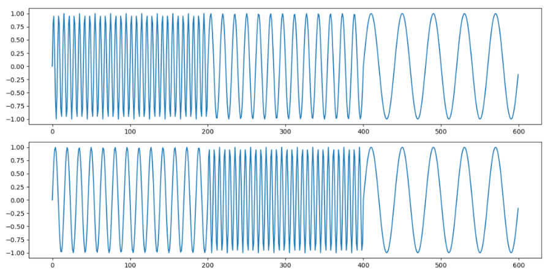

### 工作内容
1. 运行代码，加入优化器和针对非平稳数据的注意力机制
2. 傅里叶变换和小波变换的学习

#### CMTF: 用于金融市场预测的跨模态时间融合（2025）

**张量表示**

使用两种类型的数据：结构化数据和非结构化数据。对于非结构化的新闻和财务报告数据，采用两种互补的方法进行处理：
新闻数据：使用CatBoost的梯度提升优化决策树来提取分类张量 Z^{n}。
财务报告数据：使用大语言模型作为NLP张量提取器。

**张量编码**
对于非每日粒度的数据，应用加权移动平均（Weighted Moving Average，WMA）来模拟事件影响的衰减：

​​ 对于非每日的数据（宏观），使用​​加权移动平均 (WMA)​​。如果一个事件发生在某天，它的影响不会只在那一天，而是会持续几天。WMA计算过去一段时间（比如30天）内，该事件数据的加权平均。​​离预测日越近的日子，权重越大。​​ 这样，即使宏观数据是上月发布的，它在本月的每一天都有一个“衰减后的影响力”值。

然后将时间融合（Temporal Fusion，TF）应用于所有张量：

**张量解释**
提出了一种可解释的特征选择框架，结合时间稀疏性和稳定性分析，包括四个阶段：

1. 相关性引导的预选择：通过平均绝对相关阈值消除多重共线性特征：

其中相关分数Corr从X的相关矩阵计算得出。
作用：计算每个特征 d 与其他特征的平均绝对相关系数，若高于阈值 τcorr，则认为冗余并剔除。

2. 时间特征扩展：通过一阶时间卷积构建滞后特征以捕捉延迟的市场响应：

​​作用​​：为每个特征添加其前一时刻的值，显式捕捉滞后效应。

3. 多任务组稀疏性：求解凸时间组LASSO目标：

组套索（Group Lasso）​​：Yuan & Lin (2006) 提出，用于分组特征选择。
​​多任务学习（MTL）​​：Caruana (1997) 提出，共享特征提升泛化。

作用：

4. 稳定性选择：通过多数投票保留在时间折叠中具有持久预测能力的特征：

**预测模型**
基础Transformer模型
使用Optuna作为优化框架，它采用异步连续减半算法，配备两个估计器来有效地搜索超参数空间中的局部最优值。

#### 代码实现结果（黄金价格）：

|   | MSE   | MAE   |
|-------|-------|-------|
| TimeXer | 0.473 | 0.537 |
| TimesNet | 0.455 | 0.530 |
| TimeMixer | 0.738 | 0.656 |
| TimeXer_op| 0.437| 0.518|
| TimesNet_op| 0.465| 0.535|
| TimeMixer_op| 0.444| 0.523|
| TimeXer+NST| 0.751| 0.655

**傅里叶变换**

傅里叶变换（Fourier Transform）能够将一个函数（在时间序列问题中，通常是离散的点）从时域转换到频域。它可以把一个复杂的随时间变化的信号分解成许多不同频率的正弦波和余弦波的组合。

做傅立叶变换的好处：频率成分分析、滤波噪声、数据压缩

1. 频率成分分析
在时间序列研究中，许多时序数据包含复杂的周期性和非周期性成分。傅里叶变换可以将时间序列从时域转换到频域，从而清晰地揭示出数据中隐藏的频率成分。通过把混合数据分解为季度+周+日不同的频率维度，有助于理解数据背后的规律。

1. 时序数据滤波
由于测量误差或短暂干扰，时间序列中可能存在高频噪声，可以在频域中去除这些高频成分，通过设置频率阈值来实现滤波，然后通过反傅里叶变换将数据恢复到时域，得到滤波后的时间序列

1. 数据压缩和降维
在频域中，通常只有少数频率成分包含了大部分的信息。可以通过保留这些主要频率成分，忽略次要频率成分，实现数据的压缩。对于长周期的时间序列数据，傅里叶变换后的频域表示可以用于数据压缩。

**小波变换**
傅里叶变换是一种频域分析方法，它基于傅里叶级数的思想，将信号表示为一系列不同频率的正弦和余弦函数的线性组合。傅里叶变换将信号从时域转换到频域（时域信息完全丢失），得到信号的频谱，频谱反映了信号中不同频率成分的幅度和相位信息。但是有时候，我们希望知道时间序列在不同时刻的频域信息，这时候傅立叶变换就行不通了。此外，如果是下面的情况，频率成分相同，但是时间位置不同，傅立叶变换也是识别不出来了的。这就是FFT的不足。

如果我们做傅立叶变换，会得到同样的频率分析图。这就是傅立叶变换的不足之处，失去了时间维度信息。而小波变换能够同时得到时间和频率两个维度的特征分析结果。

小波变换也是一种时频分析方法，它通过一组小波基函数对信号进行分解。得到不同尺度和位置的近似系数和细节系数，这些系数反映了信号在不同时间和频率上的局部特征。所以小波变换的结果实际上反映了两个维度：时间和频率，小波变换更适合处理非平稳信号，通过不同尺度的小波函数来捕捉信号在不同时间和频率上的变化，也能够有效地提取信号中的突变、瞬态和局部特征。

- 小波变换：具有良好的时频局部性，能够同时在时间和频率上对信号进行局部分析。支持多分辨率分析，通过多级分解可以在不同尺度下观察信号的特征。不同尺度的小波基函数可以捕捉信号在不同时间和频率上的变化，因此非常适合处理非平稳信号，例如包含突变、瞬态等特征的信号。

- 傅里叶变换：缺乏时频局部性，它只能提供信号的整体频率信息，无法确定某个频率成分在时间上的具体位置。对于非平稳信号，傅里叶变换的结果可能无法准确反映信号的时变特性。不具备多分辨率分析的能力，它只能提供单一分辨率的频域信息。

**小波变换的不同类别：**

pywt.dwt：执行一级离散小波变换（Discrete Wavelet Transform）。它将输入信号分解为两个部分，即近似系数（Approximation coefficients，低频部分，反映信号的总体趋势）和细节系数（Detail coefficients，高频部分，反映信号的局部变化）。

pywt.wavedec：执行多级离散小波变换。它会对信号进行多次分解，每一级都将上一级得到的近似系数进一步分解为新的近似系数和细节系数，最终得到不同尺度下的近似系数和各级细节系数。

pywt.cwt：执行连续小波变换。输入包括信号signal、尺度scale、小波基等。输出 coefficients 是一个二维复数矩阵，其行对应不同尺度（scales），列对应时间点，幅度 np.abs(coefficients) 反映信号在各尺度和时间点的能量强度，相位 np.angle(coefficients)提供局部相位信息；frequencies 表示各尺度对应的实际频率（Hz），尺度越小频率越高。

#### 下周工作内容
TimeMixer和TimesNet都使用傅里叶变换进行频率和周期特征的分解，使用小波变换进行模块替代看结果如何