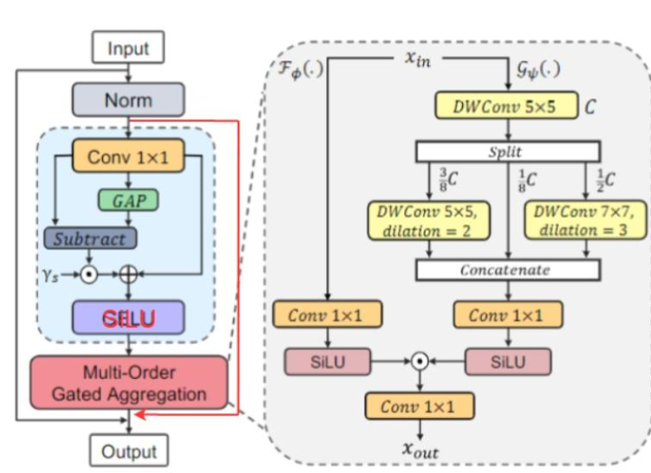
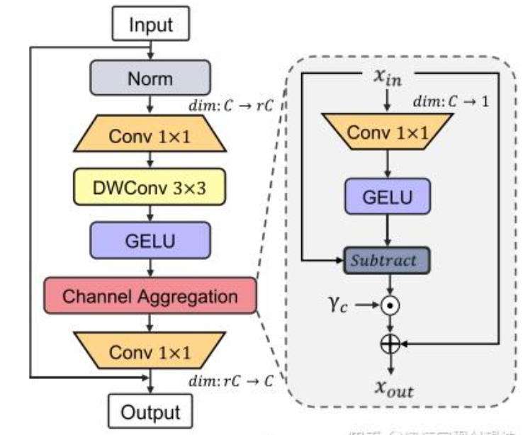
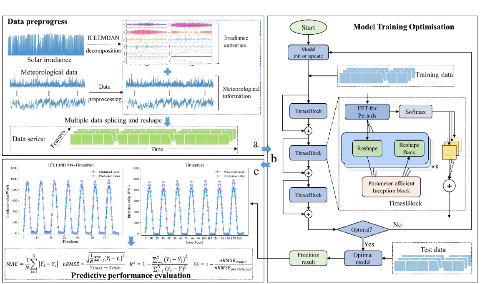

### ICEEMDAN分解原理

#### 1. 算法核心思想
ICEEMDAN（Improved Complete Ensemble Empirical Mode Decomposition with Adaptive Noise）是一种改进的自适应噪声集成经验模态分解方法。它的核心创新点在于：

- **自适应噪声策略**：只在高阶残差中添加特定幅度的白噪声
- **噪声模态利用**：使用噪声的分量而非原始噪声（与传统CEEMDAN的关键区别）
- **双阶段分解**：噪声预处理+迭代残差优化

#### 2. 数学表示
令原始信号为 $x(t)$，分解过程如下：

**第一残差计算（公式1）**：
$$
r_1 = \langle M(x + \varepsilon_0 E_1(\omega^{(i)})) \rangle
$$

**第一IMF（公式2）**：
$$
IMF_1 = x - r_1
$$

**迭代计算（公式3）**：
$$
r_k = \langle M(r_{k-1} + \varepsilon_{k-1} E_k(\omega^{(i)})) \rangle
$$
$$
IMF_k = r_{k-1} - r_k
$$

**最终残差（公式4）**：
$$
R = x - \sum_{k=1}^K IMF_k
$$

其中：
- $E_j(\cdot)$ 表示噪声的第j阶模态分量
- $\langle \cdot \rangle$ 表示集平均
- $M(\cdot)$ 为模态提取算子

#### 3. 与相关方法的对比
| **特征** | EMD | CEEMDAN | **ICEEMDAN** |
|----------|-----|---------|--------------|
| **噪声添加** | 无 | 全域添加 | **残差添加** |
| **噪声类型** | - | 原始噪声 | **噪声模态** |
| **伪模态** | 严重 | 存在 | **显著减少** |
| **计算效率** | 低 | 中 | **高** |
| **稳定性** | 低 | 中 | **高** |

### MogaNet: 高效多阶门控聚合网络

现有方法仍然存在一个表示瓶颈:自注意力或大核卷积的朴素实现阻碍了区分性上下文信息和全局交互的建模，导致DNN与人类视觉系统之间的认知差距。为此本文从特征交互复杂性的角度提出了一种纯卷积架构MogaNet。MogaNet采用类似金字塔式ViT的架构，包括两个模块：SMixer和CMixer

以在基于ConvNet的纯模型中进行信息上下文挖掘，并在复杂度和性能方面进行了更好的权衡。在MogaNet中，通过在空间和通道交互空间中利用两个专门设计的聚合模块，促进了跨多个复杂性的交互并将其情境化。

- 应用场景：对ImageNet分类、COCO目标检测和ADE20K语义分割任务

**1 SMixer**
SMixer主要包括两个模块：特征分解（FD）和多阶门控聚合（Multi-Order Gated Aggregation）

**FD**
为了强迫网络关注多阶交互，本文提出了FD模块，动态地排除不重要的交互（Patch自身的0阶交互【Conv2D 1 * 1】和覆盖所有Patch的n阶交互【GAP】），详细操作如下公式所示：

$$\begin{array}{l} Y=\operatorname{Conv}{1 \times 1}(X) \ Z=\operatorname{GELU}\left(Y+\gamma{s} \odot(Y-\operatorname{GAP}(Y))\right) \end{array}$$

**Multi-Order Gated Aggregation**
多阶门控聚合包含两个分支：聚合分支和上下文分支，聚合分支负责生成门控权重，上下文分支通过不同核大小和不同空洞大小的卷积进行多尺度的特征提取，从而捕获上下文多阶交互。值得注意的是，两个分支的输出使用SiLU激活函数（SILU既具有Sigmoid门控效应，又具有稳定的训练特性）。公式表示为：

$$Z=\underbrace{\operatorname{SiLU}\left(\operatorname{Conv}{1 \times 1}(X)\right)}{\mathcal{F}{\phi}} \odot \underbrace{\operatorname{SiLU}\left(\operatorname{Conv}{1 \times 1}\left(Y{C}\right)\right)}{\mathcal{G}_{\psi}}$$

**2 CMixer**
传统的FFN会导致大量的特征冗余，降低效率，本文提出了一种新的通道聚合模块以重分配多阶特征，通道聚合与FD操作类似，具体公式如下所示：

$$\begin{aligned} Y & =\operatorname{GELU}\left(\operatorname{DW}{3 \times 3}\left(\operatorname{Conv}{1 \times 1}(\operatorname{Norm}(X))\right)\right) \ Z & =\operatorname{Conv}{1 \times 1}(\operatorname{CA}(Y))+X \ \mathrm{CA}(X) & =X+\gamma{c} \odot\left(X-\operatorname{GELU}\left(X W_{r}\right)\right) \end{aligned}$$

思路：
1.ICEEMDAN将黄金价格分解成IMF分量作为特征
2.使用决策树/因果发现在宏观经济指标中选取多变量作为特征
3.使用改进的TimesNet（InceptionBlock卷积提取特征换成轻量级MogaNet提取）

